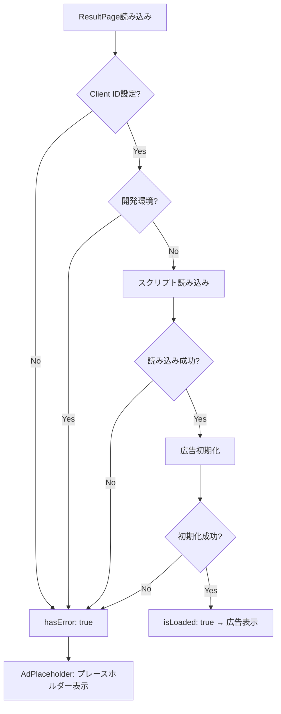
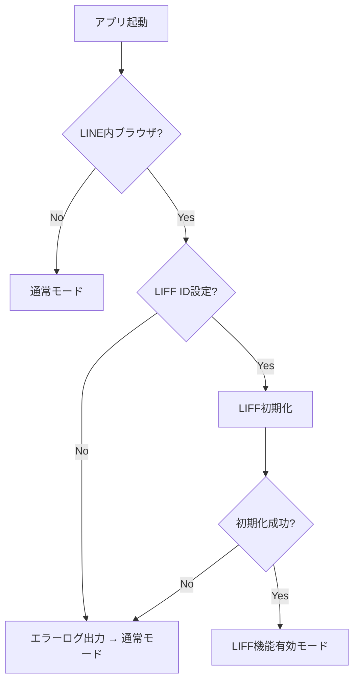

# 04_api.md - 外部API連携設計

## 概要

**外部連携サービス:**

- SNSシェア（LINE / X / Threads）
- Google AdSense（広告配信）
- LINE LIFF（LINE内ブラウザ最適化）

**方針:**

- 外部依存を最小限に
- エラー時のフォールバック実装
- ユーザー体験を損なわない

---

## 1. SNSシェア機能

### 対応SNS

| SNS     | 実装方法                 | 認証 | 備考                 |
| ------- | ------------------------ | ---- | -------------------- |
| LINE    | LIFF SDK / Web Share API | 不要 | LINE内では LIFF 優先 |
| X       | Web Intent URL           | 不要 | シンプルなURL遷移    |
| Threads | Web Intent URL           | 不要 | Meta公式のシェアURL  |

> 実装は `src/services/share.service.ts` を参照。

---

### シェアテキストテンプレート

#### A. 通常プレイ

```
🪙 コイントス予想ゲーム
{モード名}で{スコア}{単位}！
自己ベスト：{ベストスコア}{単位}
#コイントスゲーム #暇つぶし #ミニゲーム
{URL}
```

#### B. 新記録達成時（1位更新）

```
🎉🪙 自己ベスト更新！🪙🎉
{モード名}で{スコア}{単位}！
前回ベスト：{旧ベスト}{単位}
#コイントスゲーム #暇つぶし #ミニゲーム
{URL}
```

#### C. 新記録達成時（2位・3位ランクイン）

```
🪙 コイントス予想ゲーム
{モード名}で{スコア}{単位}！
自己TOP3入り🎊
#コイントスゲーム #暇つぶし #ミニゲーム
{URL}
```

---

### 各SNSのシェア方式

- **X**: `https://twitter.com/intent/tweet?text={encodedText}` を `window.open()` で開く
- **Threads**: `https://threads.net/intent/post?text={encodedText}` を `window.open()` で開く
- **LINE（LIFF内）**: `liff.shareTargetPicker()` でテキストメッセージを送信
- **LINE（LIFF外）**: Web Share API にフォールバック

### Web Share API フォールバック

- `navigator.share` が利用可能かを `isWebShareSupported()` で判定
- ユーザーがキャンセルした場合（`AbortError`）はエラーとして扱わない
- Web Share API も利用不可の場合はクリップボードコピーにフォールバック

### エラーハンドリング

シェア失敗時はクリップボードにテキストをコピーし、ユーザーに通知する。

> UI実装は `src/features/result/ShareSection/ShareSection.tsx` を参照。

---

## 2. Google AdSense 連携

### 配置仕様

| 項目           | 内容                         |
| -------------- | ---------------------------- |
| 表示位置       | 結果画面（ResultPage）       |
| 広告タイプ     | レスポンシブディスプレイ広告 |
| 表示タイミング | ゲーム終了後                 |
| 広告枠数       | 1枠のみ                      |

### 読み込みフロー



### 実装構成

| ファイル                                         | 役割                                          |
| ------------------------------------------------ | --------------------------------------------- |
| `src/hooks/useAdSense.ts`                        | AdSense スクリプト読み込み・初期化フック      |
| `src/components/AdPlaceholder/AdPlaceholder.tsx` | 広告表示 / プレースホルダー（Pure Component） |

> 各ファイルの実装を参照。

---

## 3. LINE LIFF 連携

### 初期化戦略

- **タイミング**: LINE内ブラウザを検出した場合のみ（`navigator.userAgent` に `Line/` を含む）
- **目的**: 不要な外部スクリプト読み込みを避ける
- **機能**: LINEシェアの最適化

### 初期化フロー



**ポイント:**

- LIFF初期化失敗は**非致命的エラー**
- 失敗しても通常のシェア機能にフォールバック
- 重複呼び出し防止のフラグ管理あり

> 実装は `src/services/liff.service.ts` を参照。アプリ起動時の初期化は `src/App.tsx` を参照。

---

## 4. OGP（Open Graph Protocol）設定

### 固定OGP画像

- **配置**: `public/og-image.png`
- **サイズ**: 1200x630px（推奨）
- **フォーマット**: PNG または JPG

### HTML メタタグ

`vite-plugin-html` を使用して `index.html` のメタタグに環境変数を注入する。

設定されるメタタグ:

| メタタグ         | 値                                                         |
| ---------------- | ---------------------------------------------------------- |
| `og:type`        | website                                                    |
| `og:title`       | コイントス予想ゲーム                                       |
| `og:description` | 連続で何回当てられる？暇つぶしに最適なコイントス予想ゲーム |
| `og:image`       | `{VITE_BASE_URL}/og-image.png`                             |
| `twitter:card`   | summary_large_image                                        |

> 実装は `vite.config.ts` および `index.html` を参照。

### 動作確認

- **X**: [Twitter Card Validator](https://cards-dev.twitter.com/validator) で確認
- **LINE**: [LINE OGP Debugger](https://poker.line.naver.jp/ogp/) で確認

---

## 5. 環境変数まとめ

```env
# .env（開発環境）
VITE_BASE_URL=http://localhost:5173
VITE_ADSENSE_CLIENT_ID=ca-pub-xxxxxxxxxxxxx
VITE_ADSENSE_SLOT_ID=1234567890
VITE_LIFF_ID=xxxx-xxxxxxxx
```

```env
# .env.production（本番環境）
VITE_BASE_URL=https://username.github.io/coin-toss-game
VITE_ADSENSE_CLIENT_ID=ca-pub-xxxxxxxxxxxxx
VITE_ADSENSE_SLOT_ID=1234567890
VITE_LIFF_ID=xxxx-xxxxxxxx
```

---

## 6. セキュリティ考慮

### Content Security Policy（CSP）

- **Phase 1 では不要**（AdSense審査への影響を避けるため）
- Phase 2 以降で導入検討

### 外部リンク

すべての外部リンクに `rel="noopener noreferrer"` を付与。

---

## 7. パフォーマンス最適化

### 遅延読み込み

- **AdSense**: ゲーム終了後に読み込み（初回ロード時は不要）
- **LIFF SDK**: LINE内ブラウザでのみ読み込み

---

## 8. 関連ファイル

| ファイル                            | 役割                              |
| ----------------------------------- | --------------------------------- |
| `src/services/share.service.ts`     | SNSシェアロジック                 |
| `src/services/liff.service.ts`      | LIFF連携                          |
| `src/hooks/useAdSense.ts`           | AdSense初期化フック               |
| `src/components/AdPlaceholder/`     | AdSense広告コンポーネント（Pure） |
| `src/features/result/ShareSection/` | シェアセクションUI                |
| `index.html`                        | HTMLテンプレート                  |
| `vite.config.ts`                    | OGP動的生成設定                   |
| `.env` / `.env.production`          | 環境変数                          |

---

## 9. 将来の拡張

### Phase 2（検討中）

- **動的OGP**: スコアに応じた画像生成
- **エラートラッキング**: Sentry等の導入
- **A/Bテスト**: シェアテキストの最適化

---

**作成日**: 2025年
**バージョン**: 2.0
