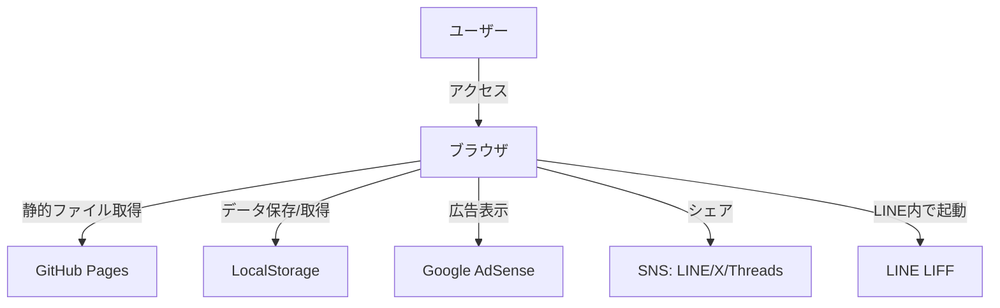
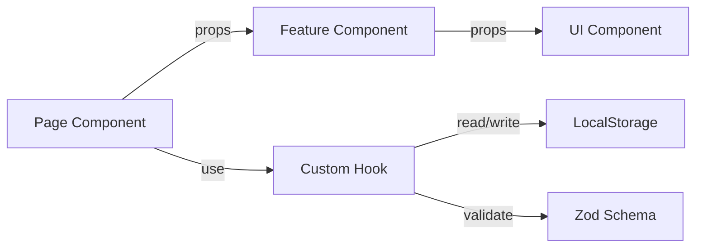
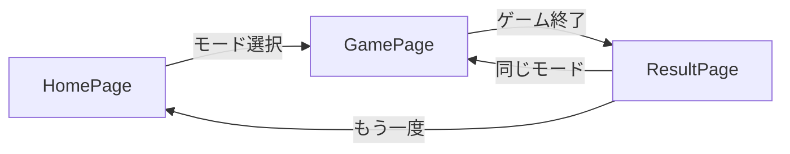
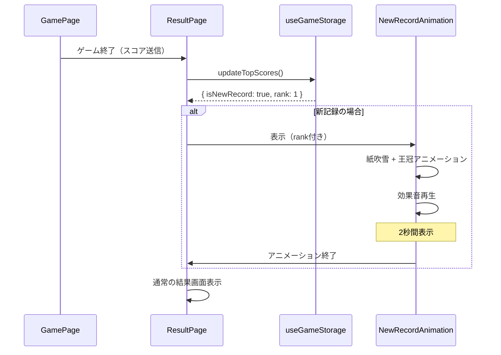
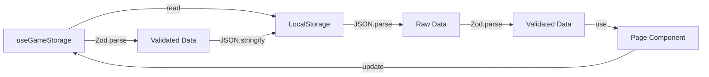
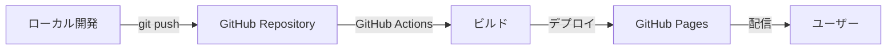

# 02_architecture.md - アーキテクチャ設計

## プロジェクト概要

**プロジェクト名**: コイントス予想ゲーム（Coin Toss Game）  
**アーキテクチャタイプ**: SPA（Single Page Application）  
**デプロイ形式**: 静的サイト（GitHub Pages）

---

## システム構成図



---

## 技術スタック

| レイヤー                         | 技術             | 用途                        |
| -------------------------------- | ---------------- | --------------------------- |
| **フロントエンド**               | React 19         | UI構築                      |
| **ビルドツール**                 | Vite             | 高速ビルド・開発サーバー    |
| **言語**                         | TypeScript       | 型安全性の確保              |
| **スキーマ定義・バリデーション** | Zod              | ランタイム型チェック        |
| **スタイリング**                 | Tailwind CSS     | ユーティリティファーストCSS |
| **アニメーション**               | Framer Motion    | コイントスアニメーション    |
| **音声**                         | Web Audio API    | 効果音のリアルタイム生成    |
| **ルーティング**                 | React Router v6  | SPA ルーティング            |
| **ストレージ**                   | LocalStorage API | スコア・設定の永続化        |
| **ホスティング**                 | GitHub Pages     | 静的サイトホスティング      |
| **広告**                         | Google AdSense   | 収益化                      |
| **LINE 連携**                    | LINE LIFF SDK    | LINE内ブラウザ最適化        |
| **OGP**                          | HTML meta タグ   | SNS シェア最適化            |

---

## アーキテクチャパターン

### 全体パターン

- **Presentation-Container パターン**
  - `components/`: プレゼンテーション層（Pure Component）
  - `pages/`: コンテナ層（状態管理・ロジック統合）
  - `features/`: 機能固有のロジックとUI

### 状態管理パターン

- **カスタムフック中心設計**
  - ビジネスロジックは `features/` 配下のカスタムフックに集約
  - `pages/` で `useState` / `useContext` を使用
  - `components/` は props のみで動作（状態を持たない）

### データフローパターン



---

## ディレクトリ構成

```
coin-toss-game/
├── public/                     # 静的ファイル
│   ├── favicon.ico
│   └── og-image.png            # OGP画像
├── src/
│   ├── components/             # 再利用可能なUIコンポーネント（Pure）
│   │   ├── Button/
│   │   │   ├── Button.tsx
│   │   │   └── Button.stories.tsx
│   │   ├── Card/
│   │   ├── Modal/
│   │   ├── ToggleSwitch/       # ダークモード・ミュート切り替え
│   │   └── AdPlaceholder/      # 広告プレースホルダー
│   ├── features/               # 機能固有のコンポーネント・ロジック
│   │   ├── game/               # ゲームロジック
│   │   │   ├── game.schema.ts  # Zodスキーマ定義
│   │   │   ├── useGameLogic.ts # ゲームロジックフック
│   │   │   ├── CoinToss/
│   │   │   │   ├── CoinToss.tsx
│   │   │   │   └── CoinToss.stories.tsx
│   │   │   └── PredictionButton/
│   │   ├── result/             # 結果画面
│   │   │   ├── result.schema.ts
│   │   │   ├── ResultSummary/
│   │   │   └── ShareButtons/
│   │   ├── mode/               # モード選択
│   │   │   ├── mode.schema.ts
│   │   │   └── ModeSelector/
│   │   └── storage/            # ローカルストレージ管理
│   │       ├── storage.schema.ts
│   │       └── useGameStorage.ts
│   ├── services/               # 副作用を伴う再利用可能なロジック
│   │   ├── audio.service.ts    # Web Audio API ラッパー
│   │   ├── share.service.ts    # SNS シェア処理
│   │   └── liff.service.ts     # LINE LIFF 連携
│   ├── hooks/                  # 汎用カスタムフック
│   │   ├── useLocalStorage.ts  # ローカルストレージ操作（汎用）
│   │   ├── useDarkMode.ts      # ダークモード管理
│   │   └── useSound.ts         # 効果音再生
│   ├── utils/                  # ユーティリティ関数
│   │   ├── coinFlip.ts         # コイントス結果生成
│   │   ├── formatScore.ts      # スコアフォーマット
│   │   └── validation.ts       # Zod バリデーションヘルパー
│   ├── styles/                 # グローバルスタイル
│   │   └── globals.css
│   ├── pages/                  # ページコンポーネント
│   │   ├── HomePage.tsx        # モード選択画面
│   │   ├── GamePage.tsx        # ゲーム画面
│   │   └── ResultPage.tsx      # 結果画面
│   ├── AppRouter.tsx           # ルーティング設定
│   ├── App.tsx                 # ルートコンポーネント
│   ├── main.tsx                # エントリーポイント
│   └── vite-env.d.ts
├── index.html                  # HTMLテンプレート（OGP設定含む）
├── package.json
├── tsconfig.json
├── tailwind.config.js
├── vite.config.ts
└── README.md
```

---

## コンポーネント設計方針

### 1. UIコンポーネント（`components/`）

- **責務**: 見た目のみ
- **特徴**:
  - 状態を持たない（Stateless）
  - 副作用を持たない（Pure）
  - props のみで動作
  - 他プロジェクトでも再利用可能
- **例**: `Button`, `Card`, `Modal`, `ToggleSwitch`, `AdPlaceholder`

### 2. 機能コンポーネント（`features/`）

- **責務**: 特定機能のUI + ロジック統合
- **特徴**:
  - カスタムフックを利用（ビジネスロジック含む）
  - ドメイン知識を含む
  - このプロジェクト固有
- **例**: `CoinToss`, `PredictionButton`, `ResultSummary`

### 3. ページコンポーネント（`pages/`）

- **責務**: 画面全体の構成・状態管理
- **特徴**:
  - `useState` / `useContext` を使用
  - カスタムフックを呼び出し
  - 子コンポーネントに props を渡す
- **例**: `HomePage`, `GamePage`, `ResultPage`

---

## 状態管理設計

### Zod スキーマ定義

#### ゲーム状態（`features/game/game.schema.ts`）

```typescript
import { z } from "zod";

export const GameModeSchema = z.enum(["10-rounds", "survival"]);
export type GameMode = z.infer<typeof GameModeSchema>;

export const CoinSideSchema = z.enum(["heads", "tails"]);
export type CoinSide = z.infer<typeof CoinSideSchema>;

export const GameStateSchema = z.object({
  mode: GameModeSchema,
  currentRound: z.number().int().min(1),
  score: z.number().int().min(0),
  isPlaying: z.boolean(),
  coinResult: CoinSideSchema.nullable(),
  prediction: CoinSideSchema.nullable(),
});
export type GameState = z.infer<typeof GameStateSchema>;
```

#### ローカルストレージ（`features/storage/storage.schema.ts`）

```typescript
import { z } from "zod";
import { GameModeSchema } from "../game/game.schema";

export const HistoryItemSchema = z.object({
  mode: GameModeSchema,
  score: z.number().int().min(0),
  timestamp: z.number().int().positive(),
});
export type HistoryItem = z.infer<typeof HistoryItemSchema>;

export const StorageDataSchema = z.object({
  bestScores: z.object({
    "10-rounds": z.number().int().min(0).default(0),
    survival: z.number().int().min(0).default(0),
  }),
  history: z.object({
    "10-rounds": z.array(HistoryItemSchema).max(3).default([]),
    survival: z.array(HistoryItemSchema).max(3).default([]),
  }),
  preferences: z.object({
    darkMode: z.boolean().default(false),
    soundEnabled: z.boolean().default(true),
  }),
});
export type StorageData = z.infer<typeof StorageDataSchema>;

// デフォルト値
export const defaultStorageData: StorageData = {
  bestScores: { "10-rounds": 0, survival: 0 },
  history: { "10-rounds": [], survival: [] },
  preferences: { darkMode: false, soundEnabled: true },
};
```

#### 結果データ（`features/result/result.schema.ts`）

```typescript
import { z } from "zod";
import { GameModeSchema } from "../game/game.schema";

export const GameResultSchema = z.object({
  mode: GameModeSchema,
  score: z.number().int().min(0),
  isNewRecord: z.boolean(),
  previousBest: z.number().int().min(0),
});
export type GameResult = z.infer<typeof GameResultSchema>;
```

### バリデーション実装例

#### LocalStorage からの復元（`features/storage/useGameStorage.ts`）

```typescript
import {
  StorageDataSchema,
  defaultStorageData,
  type StorageData,
} from "./storage.schema";

const STORAGE_KEY = "coinTossGame";

export const useGameStorage = () => {
  const loadData = (): StorageData => {
    try {
      const raw = localStorage.getItem(STORAGE_KEY);
      if (!raw) return defaultStorageData;

      const parsed = JSON.parse(raw);
      // Zod でバリデーション
      const validated = StorageDataSchema.parse(parsed);
      return validated;
    } catch (error) {
      console.error(
        "LocalStorage データが不正です。デフォルト値を使用します:",
        error,
      );
      return defaultStorageData;
    }
  };

  const saveData = (data: StorageData): void => {
    try {
      // 保存前にもバリデーション
      const validated = StorageDataSchema.parse(data);
      localStorage.setItem(STORAGE_KEY, JSON.stringify(validated));
    } catch (error) {
      console.error("保存データが不正です:", error);
    }
  };

  // ... その他の処理
};
```

### 状態の流れ

1. **Page**: `useState` でゲーム状態を管理
2. **Custom Hook**: ローカルストレージと同期（Zod でバリデーション）
3. **Props**: 子コンポーネントに伝播
4. **Callback**: イベントを親に通知

---

## ルーティング設計

### ルート定義（`AppRouter.tsx`）

```typescript
import { BrowserRouter, Routes, Route } from 'react-router-dom';
import HomePage from './pages/HomePage';
import GamePage from './pages/GamePage';
import ResultPage from './pages/ResultPage';

export const AppRouter = () => (
  <BrowserRouter basename="/coin-toss">
    <Routes>
      <Route path="/" element={<HomePage />} />
      <Route path="/game/:mode" element={<GamePage />} />
      <Route path="/result" element={<ResultPage />} />
    </Routes>
  </BrowserRouter>
);
```

### 画面遷移フロー



### ゲーム結果の受け渡し（React Router の state）

#### GamePage.tsx（送信側）

```typescript
import { useNavigate } from "react-router-dom";
import type { GameResult } from "../features/result/result.schema";

const GamePage = () => {
  const navigate = useNavigate();

  const handleGameEnd = (result: GameResult) => {
    // React Router の state で結果を渡す
    navigate("/result", { state: result });
  };

  // ...
};
```

#### ResultPage.tsx（受信側）

```typescript
import { useLocation, Navigate } from 'react-router-dom';
import { GameResultSchema } from '../features/result/result.schema';

const ResultPage = () => {
  const location = useLocation();

  // state をバリデーション
  const parseResult = () => {
    try {
      return GameResultSchema.parse(location.state);
    } catch {
      return null;
    }
  };

  const result = parseResult();

  // state がない場合はホームにリダイレクト
  if (!result) {
    return <Navigate to="/" replace />;
  }

  // ...
};
```

---

## アニメーション設計

### コイントスアニメーション

- **ライブラリ**: Framer Motion
- **実装方針**:
  - 3D回転風の演出（CSS 3D Transform）
  - アニメーション時間: 約2秒
  - ユーザーは途中で予想入力
  - 結果表示時にアニメーション停止

```typescript
// features/game/CoinToss/CoinToss.tsx
import { motion } from 'framer-motion';

<motion.div
  animate={{
    rotateY: [0, 1800], // 5回転
    scale: [1, 1.2, 1],
  }}
  transition={{ duration: 2, ease: 'easeInOut' }}
>
  {/* コイン画像 */}
</motion.div>
```

### 新記録達成時の特別演出

#### トリガー条件

- トップ3にランクインしたとき
- 特に1位更新時は最も派手に

#### アニメーション仕様

**1位更新時:**

```typescript
// features/result/NewRecordAnimation.tsx
import { motion } from 'framer-motion';

export const NewRecordAnimation = ({ rank }: { rank: 1 | 2 | 3 }) => {
  const isFirstPlace = rank === 1;

  return (
    <motion.div
      initial={{ scale: 0, rotate: -180 }}
      animate={{
        scale: [0, 1.5, 1],
        rotate: [0, 360, 0],
      }}
      transition={{
        duration: isFirstPlace ? 1.5 : 1,
        ease: "easeOut"
      }}
    >
      {/* 紙吹雪エフェクト（1位のみ） */}
      {isFirstPlace && <ConfettiEffect />}

      {/* 王冠アイコン */}
      <motion.div
        animate={{
          y: [0, -20, 0],
        }}
        transition={{
          repeat: 3,
          duration: 0.6,
        }}
      >
        👑
      </motion.div>

      {/* テキスト */}
      <motion.h2
        className="text-4xl font-bold text-yellow-400"
        animate={{
          scale: [1, 1.2, 1],
        }}
        transition={{
          repeat: 2,
          duration: 0.5,
        }}
      >
        🎉 NEW RECORD! 🎉
      </motion.h2>

      {/* サブテキスト */}
      <p className="text-xl mt-4">
        {rank === 1 && "自己ベスト更新！"}
        {rank === 2 && "2位にランクイン！"}
        {rank === 3 && "3位にランクイン！"}
      </p>
    </motion.div>
  );
};
```

**紙吹雪エフェクト:**

```typescript
// components/ConfettiEffect/ConfettiEffect.tsx
import { motion } from 'framer-motion';

export const ConfettiEffect = () => {
  const confettiCount = 50;
  const colors = ['#FFD700', '#FFA500', '#FF6347', '#4169E1'];

  return (
    <div className="absolute inset-0 pointer-events-none overflow-hidden">
      {Array.from({ length: confettiCount }).map((_, i) => (
        <motion.div
          key={i}
          className="absolute w-2 h-2 rounded-full"
          style={{
            backgroundColor: colors[i % colors.length],
            left: `${Math.random() * 100}%`,
            top: -20,
          }}
          animate={{
            y: [0, window.innerHeight + 100],
            x: [0, (Math.random() - 0.5) * 200],
            rotate: [0, 360 * (Math.random() > 0.5 ? 1 : -1)],
            opacity: [1, 1, 0],
          }}
          transition={{
            duration: 2 + Math.random() * 2,
            ease: "easeOut",
            delay: Math.random() * 0.5,
          }}
        />
      ))}
    </div>
  );
};
```

#### 効果音

**新記録時の専用サウンド:**

```typescript
// services/audio.service.ts に追加
playNewRecordSound(rank: 1 | 2 | 3): void {
  const ctx = this.getContext();
  const oscillator = ctx.createOscillator();
  const gainNode = ctx.createGain();

  oscillator.connect(gainNode);
  gainNode.connect(ctx.destination);

  if (rank === 1) {
    // 1位: 華やかな上昇音（3音階）
    oscillator.frequency.setValueAtTime(440, ctx.currentTime);
    oscillator.frequency.exponentialRampToValueAtTime(
      660, ctx.currentTime + 0.3
    );
    oscillator.frequency.exponentialRampToValueAtTime(
      880, ctx.currentTime + 0.6
    );

    gainNode.gain.setValueAtTime(0.4, ctx.currentTime);
    gainNode.gain.exponentialRampToValueAtTime(
      0.01, ctx.currentTime + 0.8
    );

    oscillator.start(ctx.currentTime);
    oscillator.stop(ctx.currentTime + 0.8);
  } else {
    // 2位・3位: シンプルな上昇音
    oscillator.frequency.setValueAtTime(440, ctx.currentTime);
    oscillator.frequency.exponentialRampToValueAtTime(
      660, ctx.currentTime + 0.4
    );

    gainNode.gain.setValueAtTime(0.3, ctx.currentTime);
    gainNode.gain.exponentialRampToValueAtTime(
      0.01, ctx.currentTime + 0.5
    );

    oscillator.start(ctx.currentTime);
    oscillator.stop(ctx.currentTime + 0.5);
  }
}
```

#### 表示タイミング



---

## 音声設計

### Web Audio API による効果音生成

- **利点**: 外部ファイル不要、軽量
- **実装**: `services/audio.service.ts`

#### 音種類

1. **コイントス音**: 短いホワイトノイズ（100ms）
2. **正解音**: 上昇するトーン（440Hz → 880Hz, 200ms）
3. **不正解音**: 下降するトーン（440Hz → 220Hz, 200ms）

#### 実装例（`services/audio.service.ts`）

```typescript
export class AudioService {
  private context: AudioContext | null = null;

  private getContext(): AudioContext {
    if (!this.context) {
      this.context = new AudioContext();
    }
    return this.context;
  }

  playCorrectSound(): void {
    const ctx = this.getContext();
    const oscillator = ctx.createOscillator();
    const gainNode = ctx.createGain();

    oscillator.connect(gainNode);
    gainNode.connect(ctx.destination);

    oscillator.frequency.setValueAtTime(440, ctx.currentTime);
    oscillator.frequency.exponentialRampToValueAtTime(
      880,
      ctx.currentTime + 0.2,
    );

    gainNode.gain.setValueAtTime(0.3, ctx.currentTime);
    gainNode.gain.exponentialRampToValueAtTime(0.01, ctx.currentTime + 0.2);

    oscillator.start(ctx.currentTime);
    oscillator.stop(ctx.currentTime + 0.2);
  }

  // playIncorrectSound(), playCoinTossSound() も同様に実装
}

export const audioService = new AudioService();
```

### ミュート設定

- **保存先**: LocalStorage (`preferences.soundEnabled`)
- **制御**: `hooks/useSound.ts` フックで管理
- **UI**: トグルスイッチ（全画面共通ヘッダー）

---

## ローカルストレージ設計

### 保存データ構造

```json
{
  "coinTossGame": {
    "bestScores": {
      "10-rounds": 8,
      "survival": 15
    },
    "history": {
      "10-rounds": [
        { "mode": "10-rounds", "score": 7, "timestamp": 1704063600000 },
        { "mode": "10-rounds", "score": 8, "timestamp": 1704067200000 }
      ],
      "survival": [
        { "mode": "survival", "score": 12, "timestamp": 1704060000000 },
        { "mode": "survival", "score": 15, "timestamp": 1704070800000 }
      ]
    },
    "preferences": {
      "darkMode": true,
      "soundEnabled": true
    }
  }
}
```

### データ操作フロー



---

## LINE LIFF 連携設計（Phase 1 に含む）

### 対応方針

- **初期実装**: LIFF SDK を組み込み、LINE 環境を検出
- **機能**:
  - LINE内ブラウザで起動時に最適化
  - LINE シェア機能の強化（`liff.shareTargetPicker()`）
  - プロフィール情報取得は**しない**（簡易実装）

### 実装（`services/liff.service.ts`）

```typescript
import liff from "@line/liff";

export class LiffService {
  private initialized = false;

  async init(liffId: string): Promise<void> {
    if (this.initialized) return;

    try {
      await liff.init({ liffId });
      this.initialized = true;
    } catch (error) {
      console.error("LIFF初期化エラー:", error);
    }
  }

  isInLineApp(): boolean {
    return this.initialized && liff.isInClient();
  }

  async shareResult(message: string): Promise<void> {
    if (!this.isInLineApp()) {
      // LINE外の場合は通常のシェア
      return;
    }

    try {
      await liff.shareTargetPicker([
        {
          type: "text",
          text: message,
        },
      ]);
    } catch (error) {
      console.error("LINEシェアエラー:", error);
    }
  }
}

export const liffService = new LiffService();
```

### 環境変数

```env
VITE_LIFF_ID=xxxx-xxxxxxxx  # LINE Developers で取得
```

---

## 広告設計

### Google AdSense 配置

- **表示タイミング**: ゲーム終了後の結果画面
- **配置**: SNSシェアボタンの上または下
- **デザイン**: レスポンシブ広告（横幅100%）

### エラー時の表示（`components/AdPlaceholder/AdPlaceholder.tsx`）

```typescript
type Props = {
  isLoaded: boolean;
};

export const AdPlaceholder = ({ isLoaded }: Props) => {
  if (isLoaded) {
    return <div id="adsense-container">{/* AdSense スクリプト */}</div>;
  }

  // 広告が読み込まれない場合
  return (
    <div className="bg-gray-100 dark:bg-gray-800 rounded-lg p-8 text-center">
      <p className="text-gray-400 dark:text-gray-600 text-sm">
        広告欄 募集中
      </p>
    </div>
  );
};
```

---

## パフォーマンス最適化

### ビルド最適化

- **Code Splitting**: React.lazy でページごとに分割
- **Tree Shaking**: 未使用コードの削除
- **Asset Optimization**: 画像圧縮（OGP画像など）

### ランタイム最適化

- **Memoization**: `useMemo` / `useCallback` でレンダリング最適化
- **Debounce**: 連続クリック防止
- **RequestAnimationFrame**: アニメーション最適化

### 目標値

- **初回ロード**: 3秒以内
- **アニメーション**: 60fps
- **バンドルサイズ**: 200KB以下（gzip圧縮後）

---

## セキュリティ設計

### 考慮事項

- **XSS対策**: React のデフォルト挙動（エスケープ処理）
- **LocalStorage**: センシティブ情報を保存しない
- **外部リンク**: `rel="noopener noreferrer"` を付与
- **Zod バリデーション**: 不正データの混入を防止

### AdSense

- Google の公式スクリプトを使用
- CSP（Content Security Policy）の設定

---

## デプロイフロー



### GitHub Actions 自動デプロイ

```yaml
# .github/workflows/deploy.yml
name: Deploy to GitHub Pages
on:
  push:
    branches: [main]
jobs:
  build-and-deploy:
    runs-on: ubuntu-latest
    steps:
      - uses: actions/checkout@v3
      - uses: actions/setup-node@v3
        with:
          node-version: 20
      - run: npm ci
      - run: npm run build
      - uses: peaceiris/actions-gh-pages@v3
        with:
          github_token: ${{ secrets.GITHUB_TOKEN }}
          publish_dir: ./dist
```

---

## 拡張性の考慮

### Phase 3（ネイティブアプリ）への拡張: Capacitor

#### Capacitor vs React Native 比較

| 項目                         | Capacitor                                 | React Native                         |
| ---------------------------- | ----------------------------------------- | ------------------------------------ |
| **既存コードの流用**         | ✅ React Web コードをほぼそのまま利用可能 | ❌ React Native 専用に書き直しが必要 |
| **学習コスト**               | ✅ Web 技術のみ（HTML/CSS/JS）            | ❌ React Native 独自の概念を学習     |
| **開発効率**                 | ✅ 1つのコードベースで Web/iOS/Android    | ⚠️ Web は別途構築が必要              |
| **パフォーマンス**           | ⚠️ WebView ベース（やや遅い）             | ✅ ネイティブコンポーネント（高速）  |
| **UI/UX**                    | ⚠️ Web ライクな見た目                     | ✅ ネイティブライクな見た目          |
| **プラグインエコシステム**   | ✅ 豊富（Cordova プラグインも利用可）     | ✅ 非常に豊富                        |
| **アニメーション**           | ⚠️ 60fps 維持がやや難しい                 | ✅ 滑らか                            |
| **ビルドサイズ**             | ⚠️ やや大きい（WebView 含む）             | ✅ 最適化しやすい                    |
| **メンテナンス**             | ✅ Web と同じコードベース                 | ❌ Web と Native で二重管理          |
| **このプロジェクトとの相性** | ✅ **最適**                               | ⚠️ オーバースペック                  |

#### Capacitor 採用理由

1. **コードの再利用性**: Phase 1 の React コードをそのまま使える
2. **シンプルなゲーム**: WebView のパフォーマンスで十分
3. **保守コスト削減**: Web/iOS/Android を1つのコードベースで管理
4. **段階的な移行**: Web → Capacitor の移行が容易

#### 対応方針

- `services/` で Platform API を抽象化
- `components/` と `utils/` は流用可能
- Capacitor プラグインで追加機能（触覚フィードバックなど）

---

## エラーハンドリング

### LocalStorage エラー

- **原因**: ストレージ容量不足、プライベートブラウジング、データ破損
- **対策**:
  - try-catch でラップ
  - Zod バリデーション失敗時はデフォルト値を使用
  - フォールバック（メモリ保存）

### AdSense 読み込みエラー

- **原因**: 広告ブロッカー、審査未通過、ネットワークエラー
- **対策**: エラー時は `AdPlaceholder` で「広告欄 募集中」を表示

### LIFF 初期化エラー

- **原因**: LIFF ID 不正、ネットワークエラー
- **対策**: エラー時は通常モードで動作（LINE機能を無効化）

---

## 開発環境

### 推奨ツール

- **エディタ**: VSCode
- **拡張機能**:
  - ESLint
  - Prettier
  - Tailwind CSS IntelliSense
  - Error Lens（Zod エラー表示）
- **ブラウザ**: Chrome DevTools

### 環境変数（`.env`）

```
VITE_ADSENSE_CLIENT_ID=ca-pub-xxxxx       # AdSense クライアントID
VITE_LIFF_ID=xxxx-xxxxxxxx                # LINE LIFF ID
VITE_BASE_URL=https://username.github.io/coin-toss  # デプロイURL
```

---

## 依存パッケージ

```json
{
  "dependencies": {
    "react": "^19.0.0",
    "react-dom": "^19.0.0",
    "react-router-dom": "^6.22.0",
    "framer-motion": "^11.0.0",
    "zod": "^3.22.0",
    "@line/liff": "^2.24.0"
  },
  "devDependencies": {
    "@types/react": "^19.0.0",
    "@types/react-dom": "^19.0.0",
    "typescript": "^5.3.0",
    "vite": "^5.0.0",
    "tailwindcss": "^3.4.0",
    "eslint": "^8.56.0",
    "prettier": "^3.2.0"
  }
}
```

---

## 備考

- シンプルさを優先し、過剰な抽象化は避ける
- 各モジュールは単一責任の原則に従う
- Zod によるランタイムバリデーションで堅牢性を確保
- TypeScript の型安全性を最大限活用
- Storybook は必要に応じて導入（初期は不要）

---

**作成日**: 2025年  
**バージョン**: 2.0
