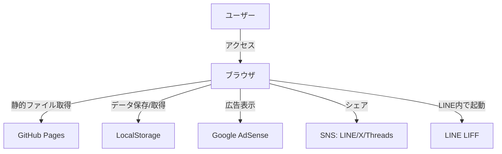
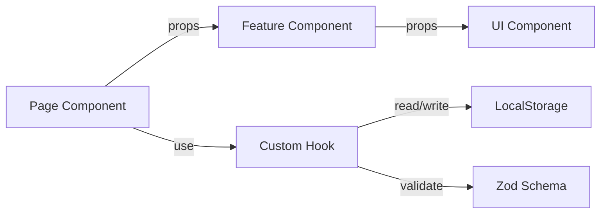
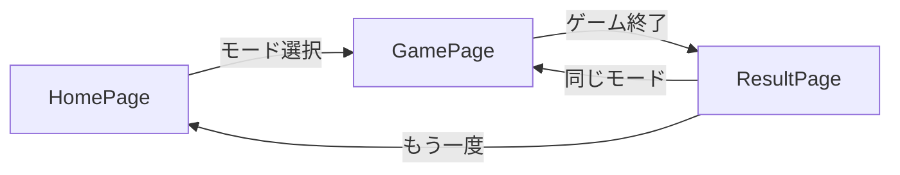
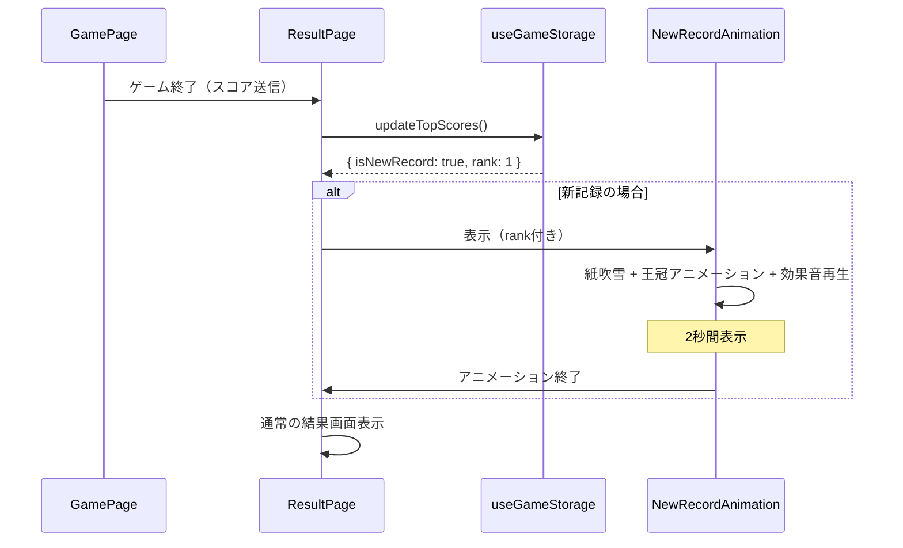
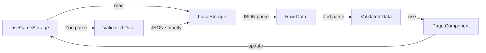
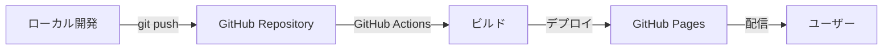

# 02_architecture.md - アーキテクチャ設計

## プロジェクト概要

**プロジェクト名**: コイントス予想ゲーム（Coin Toss Game）
**アーキテクチャタイプ**: SPA（Single Page Application）
**デプロイ形式**: 静的サイト（GitHub Pages）

---

## システム構成図



---

## 技術スタック

| レイヤー                         | 技術             | 用途                        |
| -------------------------------- | ---------------- | --------------------------- |
| **フロントエンド**               | React 19         | UI構築                      |
| **ビルドツール**                 | Vite             | 高速ビルド・開発サーバー    |
| **言語**                         | TypeScript       | 型安全性の確保              |
| **スキーマ定義・バリデーション** | Zod              | ランタイム型チェック        |
| **スタイリング**                 | Tailwind CSS     | ユーティリティファーストCSS |
| **アニメーション**               | Framer Motion    | コイントスアニメーション    |
| **音声**                         | Web Audio API    | 効果音のリアルタイム生成    |
| **ルーティング**                 | React Router v7  | SPA ルーティング            |
| **ストレージ**                   | LocalStorage API | スコア・設定の永続化        |
| **ホスティング**                 | GitHub Pages     | 静的サイトホスティング      |
| **広告**                         | Google AdSense   | 収益化                      |
| **LINE 連携**                    | LINE LIFF SDK    | LINE内ブラウザ最適化        |
| **OGP**                          | HTML meta タグ   | SNS シェア最適化            |

> 依存パッケージの詳細（バージョン含む）は `package.json` を参照。

---

## アーキテクチャパターン

### 全体パターン

- **Presentation-Container パターン**
  - `components/`: プレゼンテーション層（Pure Component）
  - `pages/`: コンテナ層（状態管理・ロジック統合）
  - `features/`: 機能固有のロジックとUI

### 状態管理パターン

- **カスタムフック中心設計**
  - ビジネスロジックは `features/` 配下のカスタムフックに集約
  - `pages/` で `useState` / `useContext` を使用
  - `components/` は props のみで動作（状態を持たない）

### データフローパターン



---

## ディレクトリ構成

```
coin-toss-game/
├── public/                     # 静的ファイル
│   ├── favicon.ico
│   └── og-image.png            # OGP画像
├── src/
│   ├── consts/                 # アプリ全体の定数定義
│   │   └── game.ts             # GameMode, CoinSide, MODE_NAMES, SCORE_UNITS
│   ├── components/             # 再利用可能なUIコンポーネント（Pure）
│   │   ├── Button/Button.tsx
│   │   ├── Card/Card.tsx
│   │   ├── Modal/Modal.tsx
│   │   ├── ToggleSwitch/ToggleSwitch.tsx
│   │   ├── GlobalHeader/GlobalHeader.tsx
│   │   ├── AdPlaceholder/AdPlaceholder.tsx
│   │   └── ConfettiEffect/ConfettiEffect.tsx
│   ├── features/               # 機能固有のコンポーネント・ロジック
│   │   ├── game/               # ゲームロジック
│   │   │   ├── game.schema.ts  # Zodスキーマ定義
│   │   │   ├── useGameLogic.ts # ゲームロジックフック
│   │   │   ├── CoinFlip3D/CoinFlip3D.tsx
│   │   │   ├── PredictionButton/PredictionButton.tsx
│   │   │   ├── ScoreDisplay/ScoreDisplay.tsx
│   │   │   ├── ResultFeedback/ResultFeedback.tsx
│   │   │   └── StreakNotification/StreakNotification.tsx
│   │   ├── result/             # 結果画面
│   │   │   ├── result.schema.ts
│   │   │   ├── ScoreCard/ScoreCard.tsx
│   │   │   ├── TopScoresComparison/TopScoresComparison.tsx
│   │   │   ├── NewRecordAnimation/NewRecordAnimation.tsx
│   │   │   ├── ShareSection/ShareSection.tsx
│   │   │   └── MotivationMessage/MotivationMessage.tsx
│   │   ├── home/               # ホーム画面
│   │   │   ├── HeroCoin/HeroCoin.tsx
│   │   │   └── LeaderBoard/LeaderBoard.tsx
│   │   ├── mode/               # モード選択
│   │   │   └── ModeCard/ModeCard.tsx
│   │   └── storage/            # ローカルストレージ管理
│   │       ├── storage.schema.ts
│   │       ├── storageOperations.ts
│   │       └── useGameStorage.ts
│   ├── services/               # 副作用を伴う再利用可能なロジック
│   │   ├── audio.service.ts    # Web Audio API ラッパー
│   │   ├── share.service.ts    # SNS シェア処理
│   │   └── liff.service.ts     # LINE LIFF 連携
│   ├── hooks/                  # 汎用カスタムフック
│   │   ├── useDarkMode.ts      # ダークモード管理
│   │   └── useSound.ts         # 効果音再生
│   ├── utils/                  # ユーティリティ関数
│   │   └── coinFlip.ts         # コイントス結果生成
│   ├── styles/                 # グローバルスタイル
│   │   └── globals.css
│   ├── pages/                  # ページコンポーネント
│   │   ├── HomePage.tsx        # モード選択画面
│   │   ├── GamePage.tsx        # ゲーム画面
│   │   └── ResultPage.tsx      # 結果画面
│   ├── AppRouter.tsx           # ルーティング設定
│   ├── App.tsx                 # ルートコンポーネント
│   ├── main.tsx                # エントリーポイント
│   └── vite-env.d.ts
├── e2e/                        # E2Eテスト（Playwright）
│   ├── home.spec.ts
│   ├── game.spec.ts
│   └── result.spec.ts
├── index.html                  # HTMLテンプレート（OGP設定含む）
├── package.json
├── tsconfig.json
├── tsconfig.node.json
├── tsconfig.e2e.json
├── tailwind.config.ts
├── vite.config.ts
├── vitest.config.ts
├── playwright.config.ts
├── .nvmrc                      # Node.js バージョン指定
└── eslint.config.js
```

---

## コンポーネント設計方針

### 1. UIコンポーネント（`components/`）

- **責務**: 見た目のみ
- **特徴**:
  - 状態を持たない（Stateless）
  - 副作用を持たない（Pure）
  - props のみで動作
  - 他プロジェクトでも再利用可能
- **例**: `Button`, `Card`, `Modal`, `ToggleSwitch`, `AdPlaceholder`

### 2. 機能コンポーネント（`features/`）

- **責務**: 特定機能のUI + ロジック統合
- **特徴**:
  - カスタムフックを利用（ビジネスロジック含む）
  - ドメイン知識を含む
  - このプロジェクト固有
- **例**: `CoinFlip3D`, `PredictionButton`, `ShareSection`

### 3. ページコンポーネント（`pages/`）

- **責務**: 画面全体の構成・状態管理
- **特徴**:
  - `useState` / `useContext` を使用
  - カスタムフックを呼び出し
  - 子コンポーネントに props を渡す
- **例**: `HomePage`, `GamePage`, `ResultPage`

---

## 状態管理設計

### 定数定義

アプリ全体で共有する定数は `src/consts/` 配下に配置する。`as const` で不変にし、型は `typeof` から派生させる。

> 実装は `src/consts/game.ts` を参照。

### Zod スキーマ定義

Zod スキーマは `src/consts/` の定数から派生させる。型の取得には `z.infer` ではなく `z.output` を使用する。

| スキーマファイル                     | 内容                                        |
| ------------------------------------ | ------------------------------------------- |
| `features/game/game.schema.ts`       | ゲーム状態（GameState, GameMode, CoinSide） |
| `features/storage/storage.schema.ts` | ストレージデータ（TopScore, Preferences）   |
| `features/result/result.schema.ts`   | 結果データ（GameResult）                    |

> 各スキーマの実装は上記ソースファイルを参照。

### 状態の流れ

1. **Page**: `useState` でゲーム状態を管理
2. **Custom Hook**: ローカルストレージと同期（Zod でバリデーション）
3. **Props**: 子コンポーネントに伝播
4. **Callback**: イベントを親に通知

---

## ルーティング設計

### ルート定義

React Router v7 のライブラリモード（BrowserRouter）を使用。

| パス          | ページ       | 説明                               |
| ------------- | ------------ | ---------------------------------- |
| `/`           | `HomePage`   | モード選択画面                     |
| `/game/:mode` | `GamePage`   | ゲーム画面（tenRounds / survival） |
| `/result`     | `ResultPage` | 結果画面                           |
| `*`           | -            | ホームにリダイレクト               |

- `BASE_URL` は `vite.config.ts` の `base` オプションから取得
- GamePage 内でモードパラメータをバリデーション（不正なモードはリダイレクト）

> 実装は `src/AppRouter.tsx` を参照。

### 画面遷移フロー



### ゲーム結果の受け渡し

React Router の `location.state` でページ間データを受け渡す。

- **GamePage（送信側）**: `navigate("/result", { state: result })` で `GameResult` を渡す
- **ResultPage（受信側）**: `useLocation().state` を `GameResultSchema.parse()` でバリデーション。state が不正な場合はホームにリダイレクト

> 実装は `src/pages/GamePage.tsx`, `src/pages/ResultPage.tsx` を参照。

---

## アニメーション設計

### コイントスアニメーション

| 項目         | 仕様                                                   |
| ------------ | ------------------------------------------------------ |
| ライブラリ   | Framer Motion                                          |
| 演出         | 3D回転風（CSS 3D Transform, rotateY: 1800deg = 5回転） |
| 時間         | 約2秒                                                  |
| ユーザー操作 | アニメーション中に予想入力                             |
| 停止         | 結果表示時にアニメーション停止                         |

> 実装は `src/features/game/CoinFlip3D/CoinFlip3D.tsx` を参照。

### 新記録達成時の特別演出

#### トリガー条件

- トップ3にランクインしたとき
- 特に1位更新時は最も派手に

#### アニメーション仕様

| 順位     | 演出                                                  | 時間  |
| -------- | ----------------------------------------------------- | ----- |
| 1位      | 紙吹雪 + 王冠回転ズームイン + 華やかな上昇音（3音階） | 1.5秒 |
| 2位・3位 | 王冠回転ズームイン + シンプルな上昇音                 | 1秒   |

> 実装は `src/features/result/NewRecordAnimation/NewRecordAnimation.tsx`, `src/components/ConfettiEffect/ConfettiEffect.tsx` を参照。

#### 表示タイミング



---

## 音声設計

### Web Audio API による効果音生成

- **利点**: 外部ファイル不要、軽量
- **実装**: `services/audio.service.ts`

#### 音種類

| 効果音          | 説明                    | 周波数            | 時間  |
| --------------- | ----------------------- | ----------------- | ----- |
| コイントス音    | 短いホワイトノイズ      | -                 | 100ms |
| 正解音          | 上昇するトーン          | 440Hz → 880Hz     | 200ms |
| 不正解音        | 下降するトーン          | 440Hz → 220Hz     | 200ms |
| 新記録（1位）   | 華やかな上昇音（3音階） | 440 → 660 → 880Hz | 800ms |
| 新記録（2-3位） | シンプルな上昇音        | 440 → 660Hz       | 500ms |

> 実装は `src/services/audio.service.ts` を参照。

### ミュート設定

- **保存先**: LocalStorage (`preferences.soundEnabled`)
- **制御**: `hooks/useSound.ts` フックで管理
- **UI**: トグルスイッチ（全画面共通ヘッダー）

---

## ローカルストレージ設計

> 詳細は `03_database.md` を参照。

### 概要

- **キー**: `coinTossGame`
- **バリデーション**: Zod スキーマで読み込み・保存時に検証
- **フォールバック**: バリデーション失敗時はデフォルト値を使用

### データ操作フロー



---

## LINE LIFF 連携設計

> 詳細な実装は `04_api.md` および `src/services/liff.service.ts` を参照。

### 対応方針

- LINE内ブラウザで起動時のみ LIFF SDK を初期化
- LINE シェア機能の強化（`liff.shareTargetPicker()`）
- プロフィール情報取得は**しない**（簡易実装）
- 初期化失敗は非致命的エラー（通常モードにフォールバック）

---

## 広告設計

> 詳細な実装は `04_api.md` を参照。

- **表示タイミング**: ゲーム終了後の結果画面
- **配置**: SNSシェアボタンの上または下
- **デザイン**: レスポンシブ広告（横幅100%）
- **エラー時**: プレースホルダーで「広告欄」を表示

---

## パフォーマンス最適化

### ビルド最適化

- **Code Splitting**: React.lazy でページごとに分割
- **Tree Shaking**: 未使用コードの削除
- **Asset Optimization**: 画像圧縮（OGP画像など）

### ランタイム最適化

- **Memoization**: `useMemo` / `useCallback` でレンダリング最適化
- **Debounce**: 連続クリック防止
- **RequestAnimationFrame**: アニメーション最適化

### 目標値

- **初回ロード**: 3秒以内
- **アニメーション**: 60fps
- **バンドルサイズ**: 200KB以下（gzip圧縮後）

---

## セキュリティ設計

### 考慮事項

- **XSS対策**: React のデフォルト挙動（エスケープ処理）
- **LocalStorage**: センシティブ情報を保存しない
- **外部リンク**: `rel="noopener noreferrer"` を付与
- **Zod バリデーション**: 不正データの混入を防止

### AdSense

- Google の公式スクリプトを使用
- CSP（Content Security Policy）の設定

---

## デプロイフロー

> 詳細は `07_deployment.md` を参照。



---

## 拡張性の考慮

### Phase 3（ネイティブアプリ）への拡張: Capacitor

#### Capacitor 採用理由

1. **コードの再利用性**: Phase 1 の React コードをそのまま使える
2. **シンプルなゲーム**: WebView のパフォーマンスで十分
3. **保守コスト削減**: Web/iOS/Android を1つのコードベースで管理
4. **段階的な移行**: Web → Capacitor の移行が容易

#### 対応方針

- `services/` で Platform API を抽象化
- `components/` と `utils/` は流用可能
- Capacitor プラグインで追加機能（触覚フィードバックなど）

---

## エラーハンドリング

### LocalStorage エラー

- **原因**: ストレージ容量不足、プライベートブラウジング、データ破損
- **対策**:
  - try-catch でラップ
  - Zod バリデーション失敗時はデフォルト値を使用
  - フォールバック（メモリ保存）

### AdSense 読み込みエラー

- **原因**: 広告ブロッカー、審査未通過、ネットワークエラー
- **対策**: エラー時は `AdPlaceholder` で「広告欄」を表示

### LIFF 初期化エラー

- **原因**: LIFF ID 不正、ネットワークエラー
- **対策**: エラー時は通常モードで動作（LINE機能を無効化）

---

## 開発環境

### 推奨ツール

- **エディタ**: VSCode（推奨拡張機能は `.vscode/extensions.json` を参照）
- **ブラウザ**: Chrome DevTools

### 環境変数（`.env`）

```
VITE_ADSENSE_CLIENT_ID=ca-pub-xxxxx       # AdSense クライアントID
VITE_LIFF_ID=xxxx-xxxxxxxx                # LINE LIFF ID
VITE_BASE_URL=https://username.github.io/coin-toss-game  # デプロイURL
```

---

## 備考

- シンプルさを優先し、過剰な抽象化は避ける
- 各モジュールは単一責任の原則に従う
- Zod によるランタイムバリデーションで堅牢性を確保
- TypeScript の型安全性を最大限活用

---

**作成日**: 2025年
**バージョン**: 3.0
