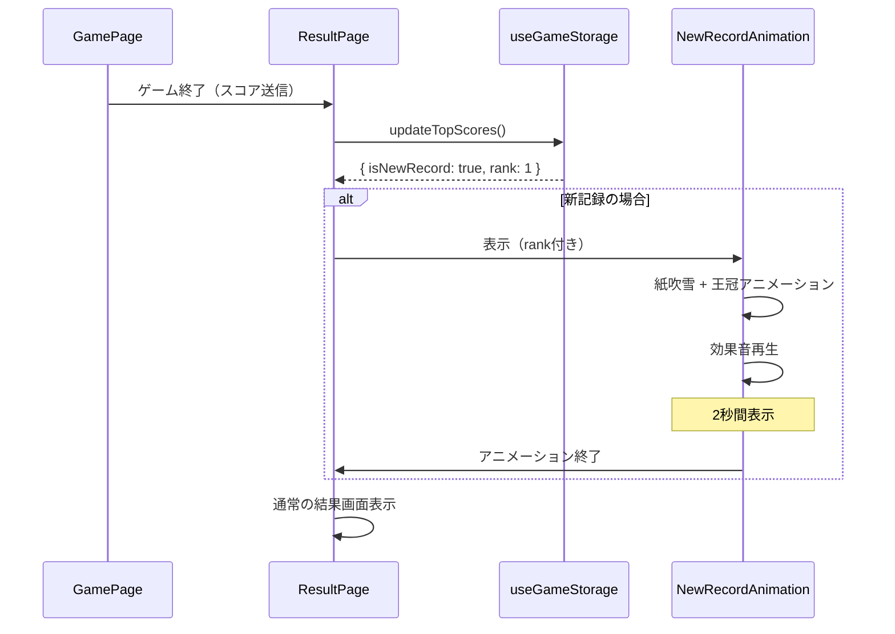

# 03_database.md - データベース設計

## 概要

**データストア**: ブラウザ LocalStorage  
**バリデーション**: Zod  
**キー**: `coinTossGame`  
**容量制限**: 5-10MB（LocalStorage標準）  
**同期**: なし（デバイスローカルのみ）

---

## データ構造

### 全体スキーマ

```typescript
{
  "topScores": {
    "10-rounds": [
      { "score": 10 },
      { "score": 9 },
      { "score": 8 }
    ],
    "survival": [
      { "score": 25 },
      { "score": 20 },
      { "score": 15 }
    ]
  },
  "preferences": {
    "darkMode": false,
    "soundEnabled": true
  }
}
```

---

## Zod スキーマ定義

### ファイル: `features/storage/storage.schema.ts`

```typescript
import { z } from "zod";
import { GameModeSchema } from "../game/game.schema";

/**
 * トップスコア項目
 * スコアのみを保存（シンプル化）
 */
export const TopScoreItemSchema = z.object({
  score: z.number().int().min(0),
});
export type TopScoreItem = z.infer<typeof TopScoreItemSchema>;

/**
 * ユーザー設定
 */
export const PreferencesSchema = z.object({
  darkMode: z.boolean().default(false),
  soundEnabled: z.boolean().default(true),
});
export type Preferences = z.infer<typeof PreferencesSchema>;

/**
 * LocalStorage 全体データ
 */
export const StorageDataSchema = z.object({
  topScores: z.object({
    "10-rounds": z.array(TopScoreItemSchema).max(3).default([]),
    survival: z.array(TopScoreItemSchema).max(3).default([]),
  }),
  preferences: PreferencesSchema,
});
export type StorageData = z.infer<typeof StorageDataSchema>;

/**
 * デフォルト値
 */
export const defaultStorageData: StorageData = {
  topScores: {
    "10-rounds": [],
    survival: [],
  },
  preferences: {
    darkMode: false,
    soundEnabled: true,
  },
};
```

---

## データ項目詳細

### 1. topScores（トップスコアランキング）

| フィールド | 型     | 必須 | 説明                  |
| ---------- | ------ | ---- | --------------------- |
| score      | number | ✅   | スコア（0以上の整数） |

**制約:**

- 各モードごとに最大3件まで保存
- スコア降順でソート
- 同点の場合は古いものを削除

**例:**

```json
{
  "10-rounds": [{ "score": 10 }, { "score": 9 }, { "score": 8 }],
  "survival": [{ "score": 25 }, { "score": 20 }, { "score": 15 }]
}
```

### 2. preferences（ユーザー設定）

| フィールド   | 型      | 必須 | デフォルト | 説明                  |
| ------------ | ------- | ---- | ---------- | --------------------- |
| darkMode     | boolean | ✅   | false      | ダークモード有効/無効 |
| soundEnabled | boolean | ✅   | true       | 効果音の有効/無効     |

**例:**

```json
{
  "darkMode": true,
  "soundEnabled": false
}
```

---

## データ操作ロジック

### ベストスコア取得

```typescript
/**
 * 指定モードのベストスコアを取得
 * @param mode ゲームモード
 * @returns ベストスコア（記録がない場合は0）
 */
export const getBestScore = (data: StorageData, mode: GameMode): number => {
  const scores = data.topScores[mode];
  if (scores.length === 0) return 0;
  return scores[0].score; // 降順ソート済みのため先頭が最高
};
```

### トップスコア更新

```typescript
/**
 * 新しいスコアをトップ3に追加（必要に応じて）
 * @param data 現在のストレージデータ
 * @param mode ゲームモード
 * @param newScore 新しいスコア
 * @returns 更新後のデータ + 新記録フラグ
 */
export const updateTopScores = (
  data: StorageData,
  mode: GameMode,
  newScore: number,
): { data: StorageData; isNewRecord: boolean; rank: number | null } => {
  const currentScores = [...data.topScores[mode]];

  // 新しいスコアを追加
  currentScores.push({ score: newScore });

  // 降順ソート
  currentScores.sort((a, b) => b.score - a.score);

  // 上位3件のみ保持
  const topThree = currentScores.slice(0, 3);

  // 新記録かどうか判定
  const newRank = topThree.findIndex((item) => item.score === newScore);
  const isNewRecord = newRank !== -1;

  return {
    data: {
      ...data,
      topScores: {
        ...data.topScores,
        [mode]: topThree,
      },
    },
    isNewRecord,
    rank: isNewRecord ? newRank + 1 : null, // 1位, 2位, 3位
  };
};
```

### データ検証・復元

```typescript
/**
 * LocalStorageからデータを読み込み、バリデーション
 */
export const loadStorageData = (): StorageData => {
  try {
    const raw = localStorage.getItem(STORAGE_KEY);
    if (!raw) return defaultStorageData;

    const parsed = JSON.parse(raw);

    // Zod バリデーション
    const validated = StorageDataSchema.parse(parsed);
    return validated;
  } catch (error) {
    console.error(
      "LocalStorage データが不正です。デフォルト値を使用します:",
      error,
    );
    return defaultStorageData;
  }
};

/**
 * データをLocalStorageに保存
 */
export const saveStorageData = (data: StorageData): void => {
  try {
    // 保存前にバリデーション
    const validated = StorageDataSchema.parse(data);
    localStorage.setItem(STORAGE_KEY, JSON.stringify(validated));
  } catch (error) {
    console.error("保存データが不正です:", error);
    throw error;
  }
};
```

---

## データ移行戦略

### Phase 1（初期リリース）

- **方針**: バージョン管理なし
- **理由**: シンプルさ優先、Zodのデフォルト値で吸収
- **破損時**: デフォルト値にフォールバック

### 将来の拡張時

**例: 新しいゲームモード追加**

```typescript
// スキーマに追加
export const StorageDataSchema = z.object({
  topScores: z.object({
    "10-rounds": z.array(TopScoreItemSchema).max(3).default([]),
    survival: z.array(TopScoreItemSchema).max(3).default([]),
    challenge: z.array(TopScoreItemSchema).max(3).default([]), // 新規
  }),
  preferences: PreferencesSchema,
});
```

- Zodの `default([])` により、既存ユーザーのデータも自動補完
- 手動マイグレーション不要

---

## エラーハンドリング

### 1. LocalStorage 容量超過

```typescript
export const saveStorageData = (data: StorageData): void => {
  try {
    const validated = StorageDataSchema.parse(data);
    localStorage.setItem(STORAGE_KEY, JSON.stringify(validated));
  } catch (error) {
    if (error instanceof DOMException && error.name === "QuotaExceededError") {
      console.error("LocalStorage容量超過");
      // フォールバック: 古いデータを削除して再試行
      // 現状の設計では3件制限のため発生しにくい
    }
    throw error;
  }
};
```

### 2. データ破損

```typescript
// Zodバリデーション失敗時
// → defaultStorageData を返す（上記 loadStorageData 参照）
```

### 3. プライベートブラウジング

```typescript
export const isLocalStorageAvailable = (): boolean => {
  try {
    const testKey = "__test__";
    localStorage.setItem(testKey, "test");
    localStorage.removeItem(testKey);
    return true;
  } catch {
    return false;
  }
};

// アプリ起動時に確認
if (!isLocalStorageAvailable()) {
  console.warn("LocalStorageが利用できません。データは保存されません。");
  // インメモリストアにフォールバック（オプション）
}
```

---

## パフォーマンス考慮

### 読み込み頻度

- **初回ロード時**: 1回のみ
- **ゲーム中**: 読み込みなし（メモリ上で管理）
- **ゲーム終了時**: 1回のみ保存

### データサイズ

- **想定サイズ**: 約500バイト
  - topScores: 各モード3件 × 2モード × 50バイト = 300バイト
  - preferences: 50バイト
  - その他: 150バイト

- **容量制限**: 5MB（LocalStorage標準）
- **余裕**: 10,000倍以上

---

## セキュリティ

### 保存データ

- **センシティブ情報なし**: スコアと設定のみ
- **暗号化不要**: 公開されても問題ない情報
- **XSS対策**: React のデフォルト挙動（エスケープ処理）

### データ改ざん

- **対策なし**: ローカルストレージは改ざん可能
- **許容理由**:
  - グローバルランキングなし
  - 他ユーザーに影響なし
  - SNSシェア時もローカルデータのみ参照

---

## テストデータ

### 開発用モックデータ

```typescript
export const mockStorageData: StorageData = {
  topScores: {
    "10-rounds": [{ score: 10 }, { score: 9 }, { score: 8 }],
    survival: [{ score: 25 }, { score: 20 }, { score: 15 }],
  },
  preferences: {
    darkMode: true,
    soundEnabled: true,
  },
};
```

### 初期状態（新規ユーザー）

```typescript
export const defaultStorageData: StorageData = {
  topScores: {
    "10-rounds": [],
    survival: [],
  },
  preferences: {
    darkMode: false,
    soundEnabled: true,
  },
};
```

---

## 関連ファイル

| ファイル                             | 役割                               |
| ------------------------------------ | ---------------------------------- |
| `features/storage/storage.schema.ts` | Zod スキーマ定義                   |
| `features/storage/useGameStorage.ts` | LocalStorage 操作カスタムフック    |
| `utils/validation.ts`                | バリデーションヘルパー関数         |
| `features/result/result.schema.ts`   | 結果データスキーマ（スコア更新時） |

---

## 補足

- **バックアップ機能**: Phase 1では不要（将来検討）
- **クラウド同期**: Phase 1では不要（将来検討）
- **データ分析**: 匿名統計取得は Phase 2 以降で検討
- **GDPR対応**: 個人情報を保存しないため対象外

---

**作成日**: 2025年  
**バージョン**: 1.0

---

# 02_architecture.md への追記内容

以下を **02_architecture.md** の「アニメーション設計」セクションに追記します：

---

## アニメーション設計（追記）

### 新記録達成時の特別演出

#### トリガー条件

- トップ3にランクインしたとき
- 特に1位更新時は最も派手に

#### アニメーション仕様

**1位更新時:**

```typescript
// features/result/NewRecordAnimation.tsx
import { motion } from 'framer-motion';

export const NewRecordAnimation = ({ rank }: { rank: 1 | 2 | 3 }) => {
  const isFirstPlace = rank === 1;

  return (
    <motion.div
      initial={{ scale: 0, rotate: -180 }}
      animate={{
        scale: [0, 1.5, 1],
        rotate: [0, 360, 0],
      }}
      transition={{
        duration: isFirstPlace ? 1.5 : 1,
        ease: "easeOut"
      }}
    >
      {/* 紙吹雪エフェクト（1位のみ） */}
      {isFirstPlace && <ConfettiEffect />}

      {/* 王冠アイコン */}
      <motion.div
        animate={{
          y: [0, -20, 0],
        }}
        transition={{
          repeat: 3,
          duration: 0.6,
        }}
      >
        👑
      </motion.div>

      {/* テキスト */}
      <motion.h2
        className="text-4xl font-bold text-yellow-400"
        animate={{
          scale: [1, 1.2, 1],
        }}
        transition={{
          repeat: 2,
          duration: 0.5,
        }}
      >
        🎉 NEW RECORD! 🎉
      </motion.h2>

      {/* サブテキスト */}
      <p className="text-xl mt-4">
        {rank === 1 && "自己ベスト更新！"}
        {rank === 2 && "2位にランクイン！"}
        {rank === 3 && "3位にランクイン！"}
      </p>
    </motion.div>
  );
};
```

**紙吹雪エフェクト:**

```typescript
// components/ConfettiEffect/ConfettiEffect.tsx
import { motion } from 'framer-motion';

export const ConfettiEffect = () => {
  const confettiCount = 50;
  const colors = ['#FFD700', '#FFA500', '#FF6347', '#4169E1'];

  return (
    <div className="absolute inset-0 pointer-events-none overflow-hidden">
      {Array.from({ length: confettiCount }).map((_, i) => (
        <motion.div
          key={i}
          className="absolute w-2 h-2 rounded-full"
          style={{
            backgroundColor: colors[i % colors.length],
            left: `${Math.random() * 100}%`,
            top: -20,
          }}
          animate={{
            y: [0, window.innerHeight + 100],
            x: [0, (Math.random() - 0.5) * 200],
            rotate: [0, 360 * (Math.random() > 0.5 ? 1 : -1)],
            opacity: [1, 1, 0],
          }}
          transition={{
            duration: 2 + Math.random() * 2,
            ease: "easeOut",
            delay: Math.random() * 0.5,
          }}
        />
      ))}
    </div>
  );
};
```

#### 効果音

**新記録時の専用サウンド:**

```typescript
// services/audio.service.ts に追加
playNewRecordSound(rank: 1 | 2 | 3): void {
  const ctx = this.getContext();
  const oscillator = ctx.createOscillator();
  const gainNode = ctx.createGain();

  oscillator.connect(gainNode);
  gainNode.connect(ctx.destination);

  if (rank === 1) {
    // 1位: 華やかな上昇音（3音階）
    oscillator.frequency.setValueAtTime(440, ctx.currentTime);
    oscillator.frequency.exponentialRampToValueAtTime(
      660, ctx.currentTime + 0.3
    );
    oscillator.frequency.exponentialRampToValueAtTime(
      880, ctx.currentTime + 0.6
    );

    gainNode.gain.setValueAtTime(0.4, ctx.currentTime);
    gainNode.gain.exponentialRampToValueAtTime(
      0.01, ctx.currentTime + 0.8
    );

    oscillator.start(ctx.currentTime);
    oscillator.stop(ctx.currentTime + 0.8);
  } else {
    // 2位・3位: シンプルな上昇音
    oscillator.frequency.setValueAtTime(440, ctx.currentTime);
    oscillator.frequency.exponentialRampToValueAtTime(
      660, ctx.currentTime + 0.4
    );

    gainNode.gain.setValueAtTime(0.3, ctx.currentTime);
    gainNode.gain.exponentialRampToValueAtTime(
      0.01, ctx.currentTime + 0.5
    );

    oscillator.start(ctx.currentTime);
    oscillator.stop(ctx.currentTime + 0.5);
  }
}
```

#### 表示タイミング


