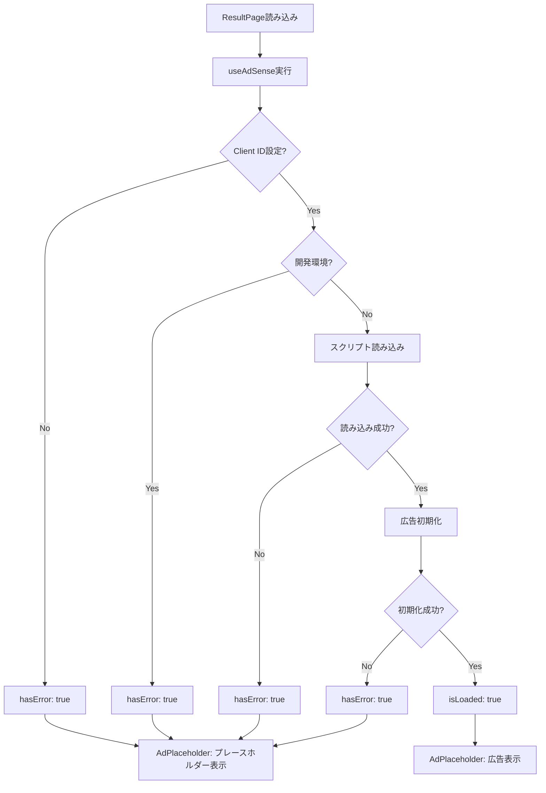
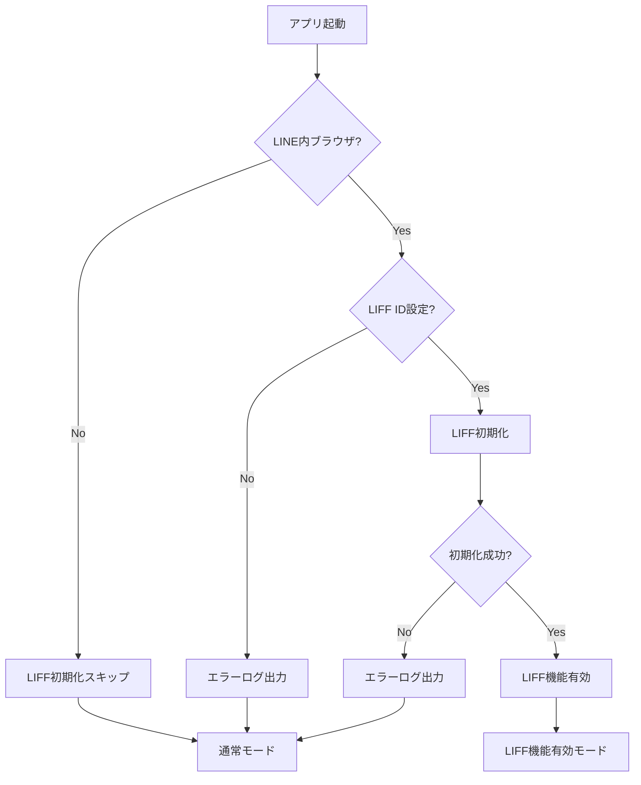

# 04_api.md - 外部API連携設計（修正版）

## 概要

**外部連携サービス:**

- SNSシェア（LINE / X / Threads）
- Google AdSense（広告配信）
- LINE LIFF（LINE内ブラウザ最適化）

**方針:**

- 外部依存を最小限に
- エラー時のフォールバック実装
- ユーザー体験を損なわない

---

## 1. SNSシェア機能

### 対応SNS

| SNS     | 実装方法                 | 認証 | 備考                 |
| ------- | ------------------------ | ---- | -------------------- |
| LINE    | LIFF SDK / Web Share API | 不要 | LINE内では LIFF 優先 |
| X       | Web Intent URL           | 不要 | シンプルなURL遷移    |
| Threads | Web Intent URL           | 不要 | Meta公式のシェアURL  |

---

### シェアテキストテンプレート

#### A. 通常プレイ（10回モード）

```
🪙 コイントス予想ゲーム
10回モードで8回正解！
自己ベスト：10回
#コイントスゲーム #暇つぶし #ミニゲーム
https://username.github.io/coin-toss
```

#### B. 通常プレイ（サバイバルモード）

```
🪙 コイントス予想ゲーム
サバイバルモードで15連続正解！
自己ベスト：20連続
#コイントスゲーム #暇つぶし #ミニゲーム
https://username.github.io/coin-toss
```

#### C. 新記録達成時（1位更新）

```
🎉🪙 自己ベスト更新！🪙🎉
サバイバルモードで25連続正解！
前回ベスト：20連続
#コイントスゲーム #暇つぶし #ミニゲーム
https://username.github.io/coin-toss
```

#### D. 新記録達成時（2位・3位ランクイン）

```
🪙 コイントス予想ゲーム
10回モードで9回正解！
自己TOP3入り🎊
#コイントスゲーム #暇つぶし #ミニゲーム
https://username.github.io/coin-toss
```

---

### シェアテキスト生成ロジック

**ファイル: `services/share.service.ts`**

```typescript
import { GameMode } from "../features/game/game.schema";

type ShareTextParams = {
  mode: GameMode;
  score: number;
  bestScore: number;
  isNewRecord: boolean;
  rank: number | null;
};

/**
 * モード名定義
 */
const MODE_NAMES = {
  tenRounds: "10回モード",
  survival: "サバイバルモード",
} as const;

/**
 * スコア単位定義
 */
const SCORE_UNITS = {
  tenRounds: "回正解",
  survival: "連続正解",
} as const;

/**
 * モード名を取得
 */
const getModeName = (mode: GameMode): string => {
  return MODE_NAMES[mode];
};

/**
 * スコア表示用テキスト
 */
const getScoreText = (mode: GameMode, score: number): string => {
  return `${score}${SCORE_UNITS[mode]}`;
};

/**
 * シェアテキストを生成
 */
export const generateShareText = (params: ShareTextParams): string => {
  const { mode, score, bestScore, isNewRecord, rank } = params;
  const baseUrl = import.meta.env.VITE_BASE_URL || window.location.origin;
  const hashtags = "#コイントスゲーム #暇つぶし #ミニゲーム";

  // 1位更新時
  if (isNewRecord && rank === 1) {
    return [
      "🎉🪙 自己ベスト更新！🪙🎉",
      `${getModeName(mode)}で${getScoreText(mode, score)}！`,
      bestScore > 0 ? `前回ベスト：${getScoreText(mode, bestScore)}` : "",
      hashtags,
      baseUrl,
    ]
      .filter(Boolean)
      .join("\n");
  }

  // 2位・3位ランクイン時
  if (isNewRecord && rank !== null) {
    return [
      "🪙 コイントス予想ゲーム",
      `${getModeName(mode)}で${getScoreText(mode, score)}！`,
      "自己TOP3入り🎊",
      hashtags,
      baseUrl,
    ].join("\n");
  }

  // 通常プレイ
  return [
    "🪙 コイントス予想ゲーム",
    `${getModeName(mode)}で${getScoreText(mode, score)}！`,
    `自己ベスト：${getScoreText(mode, bestScore)}`,
    hashtags,
    baseUrl,
  ].join("\n");
};
```

---

### 各SNSの実装

#### X（旧Twitter）シェア

```typescript
/**
 * Xでシェア
 */
export const shareToX = (text: string): void => {
  const encodedText = encodeURIComponent(text);
  const url = `https://twitter.com/intent/tweet?text=${encodedText}`;

  window.open(url, "_blank", "noopener,noreferrer,width=600,height=400");
};
```

#### Threads シェア

```typescript
/**
 * Threadsでシェア
 */
export const shareToThreads = (text: string): void => {
  const encodedText = encodeURIComponent(text);
  const url = `https://threads.net/intent/post?text=${encodedText}`;

  window.open(url, "_blank", "noopener,noreferrer,width=600,height=400");
};
```

#### LINE シェア（LIFF SDK使用）

```typescript
import liff from "@line/liff";

/**
 * LINEでシェア（LIFF SDK）
 */
export const shareToLine = async (text: string): Promise<void> => {
  // LIFF環境チェック
  if (!liff.isInClient()) {
    // LINE外の場合は Web Share API にフォールバック
    await shareViaWebShareAPI(text);
    return;
  }

  try {
    await liff.shareTargetPicker([
      {
        type: "text",
        text,
      },
    ]);
  } catch (error) {
    console.error("LINEシェアエラー:", error);
    throw error;
  }
};
```

#### Web Share API フォールバック

```typescript
/**
 * Web Share API でシェア（モバイル環境）
 */
const shareViaWebShareAPI = async (text: string): Promise<void> => {
  if (!navigator.share) {
    throw new Error("Web Share API not supported");
  }

  try {
    await navigator.share({
      text,
    });
  } catch (error) {
    if (error instanceof Error && error.name === "AbortError") {
      // ユーザーがキャンセル（エラーとして扱わない）
      return;
    }
    throw error;
  }
};
```

---

### エラーハンドリング

**ファイル: `features/result/ShareButtons/ShareButtons.tsx`**

```typescript
import { useState } from "react";
import { shareToX, shareToThreads, shareToLine } from "../../../services/share.service";

type Props = {
  shareText: string;
};

export const ShareButtons = ({ shareText }: Props) => {
  const [copySuccess, setCopySuccess] = useState(false);

  /**
   * クリップボードにコピー
   */
  const copyToClipboard = async (): Promise<void> => {
    try {
      await navigator.clipboard.writeText(shareText);
      setCopySuccess(true);

      setTimeout(() => {
        setCopySuccess(false);
      }, 2000);
    } catch (error) {
      console.error("クリップボードコピー失敗:", error);
    }
  };

  /**
   * シェア実行（エラー時はクリップボードコピー）
   */
  const handleShare = async (
    shareFunction: () => void | Promise<void>
  ): Promise<void> => {
    try {
      await shareFunction();
    } catch (error) {
      console.error("シェア失敗:", error);
      // フォールバック: クリップボードにコピー
      await copyToClipboard();
      alert("シェアに失敗しました。テキストをクリップボードにコピーしました。");
    }
  };

  return (
    <div className="flex flex-col gap-4">
      {/* SNSボタン */}
      <div className="flex gap-3 justify-center">
        <button
          onClick={() => handleShare(() => shareToX(shareText))}
          className="btn btn-x"
        >
          X でシェア
        </button>

        <button
          onClick={() => handleShare(() => shareToThreads(shareText))}
          className="btn btn-threads"
        >
          Threads でシェア
        </button>

        <button
          onClick={() => handleShare(() => shareToLine(shareText))}
          className="btn btn-line"
        >
          LINE でシェア
        </button>
      </div>

      {/* クリップボードコピーボタン */}
      <button
        onClick={copyToClipboard}
        className="btn btn-secondary"
      >
        {copySuccess ? "✅ コピー完了" : "📋 テキストをコピー"}
      </button>
    </div>
  );
};
```

---

## 2. Google AdSense 連携

### 配置仕様

| 項目           | 内容                         |
| -------------- | ---------------------------- |
| 表示位置       | 結果画面（ResultPage）       |
| 広告タイプ     | レスポンシブディスプレイ広告 |
| 表示タイミング | ゲーム終了後                 |
| 広告枠数       | 1枠のみ                      |

---

### 実装（修正版）

**ファイル: `hooks/useAdSense.ts`**（カスタムフック）

```typescript
import { useEffect, useState } from "react";

type UseAdSenseResult = {
  isLoaded: boolean;
  hasError: boolean;
};

/**
 * AdSense スクリプト読み込み・初期化フック
 */
export const useAdSense = (): UseAdSenseResult => {
  const [isLoaded, setIsLoaded] = useState(false);
  const [hasError, setHasError] = useState(false);

  const clientId = import.meta.env.VITE_ADSENSE_CLIENT_ID;

  useEffect(() => {
    // 開発環境または Client ID 未設定
    if (!clientId || import.meta.env.DEV) {
      setHasError(true);
      return;
    }

    // AdSense スクリプト読み込み
    const script = document.createElement("script");
    script.src = `https://pagead2.googlesyndication.com/pagead/js/adsbygoogle.js?client=${clientId}`;
    script.async = true;
    script.crossOrigin = "anonymous";

    script.onload = () => {
      setIsLoaded(true);

      // 広告初期化
      try {
        (window.adsbygoogle = window.adsbygoogle || []).push({});
      } catch (error) {
        console.error("AdSense 初期化エラー:", error);
        setHasError(true);
      }
    };

    script.onerror = () => {
      console.error("AdSense スクリプト読み込み失敗");
      setHasError(true);
    };

    document.head.appendChild(script);

    return () => {
      // クリーンアップ（スクリプトは削除しない）
    };
  }, [clientId]);

  return { isLoaded, hasError };
};

// TypeScript 型定義
declare global {
  interface Window {
    adsbygoogle: unknown[];
  }
}
```

**ファイル: `components/AdPlaceholder/AdPlaceholder.tsx`**（Pure Component）

```typescript
type Props = {
  isLoaded: boolean;
  hasError: boolean;
  clientId: string;
  adSlot: string;
  className?: string;
};

export const AdPlaceholder = ({
  isLoaded,
  hasError,
  clientId,
  adSlot,
  className = "",
}: Props) => {
  // エラー時またはロード中はプレースホルダー
  if (hasError || !isLoaded) {
    return (
      <div
        className={`bg-gray-100 dark:bg-gray-800 rounded-lg p-8 text-center ${className}`}
      >
        <p className="text-gray-400 dark:text-gray-600 text-sm">
          広告欄
        </p>
      </div>
    );
  }

  // AdSense 広告
  return (
    <div className={className}>
      <ins
        className="adsbygoogle"
        style={{ display: "block" }}
        data-ad-client={clientId}
        data-ad-slot={adSlot}
        data-ad-format="auto"
        data-full-width-responsive="true"
      />
    </div>
  );
};
```

**ファイル: `pages/ResultPage.tsx`**（使用例）

```typescript
import { useAdSense } from "../hooks/useAdSense";
import { AdPlaceholder } from "../components/AdPlaceholder/AdPlaceholder";

export const ResultPage = () => {
  const { isLoaded, hasError } = useAdSense();

  const clientId = import.meta.env.VITE_ADSENSE_CLIENT_ID || "";
  const adSlot = import.meta.env.VITE_ADSENSE_SLOT_ID || "";

  return (
    <div>
      {/* ゲーム結果表示 */}

      {/* 広告 */}
      <AdPlaceholder
        isLoaded={isLoaded}
        hasError={hasError}
        clientId={clientId}
        adSlot={adSlot}
        className="my-8"
      />

      {/* シェアボタン */}
    </div>
  );
};
```

---

### 環境変数

```env
# .env
VITE_ADSENSE_CLIENT_ID=ca-pub-xxxxxxxxxxxxx
VITE_ADSENSE_SLOT_ID=1234567890
```

---

### エラー時の挙動



---

## 3. LINE LIFF 連携

### 初期化戦略

- **タイミング**: LINE内ブラウザを検出した場合のみ
- **目的**: 不要な外部スクリプト読み込みを避ける
- **機能**: LINEシェアの最適化

---

### 実装

**ファイル: `services/liff.service.ts`**

```typescript
import liff from "@line/liff";

class LiffService {
  private initialized = false;
  private initializing = false;

  /**
   * LINE内ブラウザかどうか判定
   */
  isLineApp(): boolean {
    const ua = navigator.userAgent;
    return ua.includes("Line/");
  }

  /**
   * LIFF初期化
   */
  async init(): Promise<void> {
    // すでに初期化済み
    if (this.initialized) {
      return;
    }

    // 初期化中（重複呼び出し防止）
    if (this.initializing) {
      return;
    }

    // LINE内ブラウザでない場合はスキップ
    if (!this.isLineApp()) {
      console.log("LINE外環境のため、LIFF初期化をスキップ");
      return;
    }

    const liffId = import.meta.env.VITE_LIFF_ID;

    if (!liffId) {
      console.error("LIFF ID が設定されていません");
      return;
    }

    this.initializing = true;

    try {
      await liff.init({ liffId });
      this.initialized = true;
      console.log("LIFF初期化成功");
    } catch (error) {
      console.error("LIFF初期化エラー:", error);
    } finally {
      this.initializing = false;
    }
  }

  /**
   * LIFF初期化済みかどうか
   */
  isInitialized(): boolean {
    return this.initialized;
  }

  /**
   * LINE内ブラウザかつLIFF初期化済みかどうか
   */
  isInClient(): boolean {
    return this.initialized && liff.isInClient();
  }

  /**
   * LINEシェア（shareTargetPicker）
   */
  async shareTargetPicker(text: string): Promise<void> {
    if (!this.isInClient()) {
      throw new Error("LIFF環境ではありません");
    }

    try {
      await liff.shareTargetPicker([
        {
          type: "text",
          text,
        },
      ]);
    } catch (error) {
      console.error("LINEシェアエラー:", error);
      throw error;
    }
  }
}

export const liffService = new LiffService();
```

---

### アプリ起動時の初期化

**ファイル: `App.tsx`**

```typescript
import { useEffect } from "react";
import { liffService } from "./services/liff.service";

export const App = () => {
  useEffect(() => {
    // LINE内ブラウザの場合のみLIFF初期化
    if (liffService.isLineApp()) {
      liffService.init().catch((error) => {
        console.error("LIFF初期化失敗（非致命的エラー）:", error);
      });
    }
  }, []);

  return (
    <div className="App">
      {/* アプリコンテンツ */}
    </div>
  );
};
```

---

### 環境変数

```env
# .env
VITE_LIFF_ID=xxxx-xxxxxxxx
```

LIFF ID は [LINE Developers Console](https://developers.line.biz/console/) で取得

---

### エラーハンドリング



**ポイント:**

- LIFF初期化失敗は**非致命的エラー**
- 失敗しても通常のシェア機能にフォールバック

---

## 4. OGP（Open Graph Protocol）設定

## 4. OGP（Open Graph Protocol）設定（修正版）

### 固定OGP画像

**配置:**

- `public/og-image.png`
- サイズ: 1200×630px（推奨）
- フォーマット: PNG または JPG

---

### HTML メタタグ（Vite プラグインで動的生成）

**ファイル: `vite.config.ts`**

```typescript
import { defineConfig, loadEnv } from "vite";
import react from "@vitejs/plugin-react";
import { createHtmlPlugin } from "vite-plugin-html";

export default defineConfig(({ mode }) => {
  const env = loadEnv(mode, process.cwd(), "");

  return {
    plugins: [
      react(),
      createHtmlPlugin({
        minify: true,
        inject: {
          data: {
            title: "コイントス予想ゲーム",
            description:
              "連続で何回当てられる？暇つぶしに最適なコイントス予想ゲーム",
            baseUrl:
              env.VITE_BASE_URL || "https://username.github.io/coin-toss",
          },
        },
      }),
    ],
  };
});
```

**ファイル: `index.html`**

```html
<!DOCTYPE html>
<html lang="ja">
  <head>
    <meta charset="UTF-8" />
    <meta name="viewport" content="width=device-width, initial-scale=1.0" />

    <!-- 基本メタタグ -->
    <title><%= title %></title>
    <meta name="description" content="<%= description %>" />

    <!-- OGP -->
    <meta property="og:type" content="website" />
    <meta property="og:title" content="<%= title %>" />
    <meta property="og:description" content="<%= description %>" />
    <meta property="og:url" content="<%= baseUrl %>" />
    <meta property="og:image" content="<%= baseUrl %>/og-image.png" />
    <meta property="og:site_name" content="<%= title %>" />
    <meta property="og:locale" content="ja_JP" />

    <!-- Twitter Card -->
    <meta name="twitter:card" content="summary_large_image" />
    <meta name="twitter:title" content="<%= title %>" />
    <meta name="twitter:description" content="<%= description %>" />
    <meta name="twitter:image" content="<%= baseUrl %>/og-image.png" />

    <link rel="icon" type="image/png" href="/favicon.ico" />
  </head>
  <body>
    <div id="root"></div>
    <script type="module" src="/src/main.tsx"></script>
  </body>
</html>
```

**依存パッケージ追加:**

```bash
npm install -D vite-plugin-html
```

または

```json
{
  "devDependencies": {
    "vite-plugin-html": "^3.2.0"
  }
}
```

---

### 動作確認

**開発環境:**

```bash
VITE_BASE_URL=http://localhost:5173 npm run dev
```

**本番ビルド:**

```bash
VITE_BASE_URL=https://username.github.io/coin-toss npm run build
```

ビルド後の `dist/index.html` を確認すると、環境変数が反映されたメタタグが生成されています。

---

### OGP画像デザイン案

```
┌────────────────────────────────────┐
│                                    │
│          🪙 コイントス              │
│         予想ゲーム                  │
│                                    │
│   連続で何回当てられる？            │
│                                    │
│   [コインのビジュアル画像]          │
│                                    │
│     暇つぶしに最適！                │
│                                    │
└────────────────────────────────────┘
```

**推奨ツール:**

- Canva（無料）
- Figma（無料）
- Adobe Express（無料プラン）

---

## 5. 環境変数まとめ

```env
# .env（開発環境）
VITE_BASE_URL=http://localhost:5173
VITE_ADSENSE_CLIENT_ID=ca-pub-xxxxxxxxxxxxx
VITE_ADSENSE_SLOT_ID=1234567890
VITE_LIFF_ID=xxxx-xxxxxxxx
```

```env
# .env.production（本番環境）
VITE_BASE_URL=https://username.github.io/coin-toss
VITE_ADSENSE_CLIENT_ID=ca-pub-xxxxxxxxxxxxx
VITE_ADSENSE_SLOT_ID=1234567890
VITE_LIFF_ID=xxxx-xxxxxxxx
```

---

## 6. セキュリティ考慮

### Content Security Policy（CSP）

**将来的な実装（Phase 2）:**

```html
<meta
  http-equiv="Content-Security-Policy"
  content="
  default-src 'self';
  script-src 'self' 'unsafe-inline' https://pagead2.googlesyndication.com https://static.line-scdn.net;
  img-src 'self' data: https:;
  style-src 'self' 'unsafe-inline';
  connect-src 'self' https://pagead2.googlesyndication.com;
  frame-src https://googleads.g.doubleclick.net;
"
/>
```

**Phase 1 では不要**（AdSense審査への影響を避けるため）

---

### 外部リンク

すべての外部リンクに `rel="noopener noreferrer"` を付与

```typescript
// SNSシェアボタン
window.open(url, "_blank", "noopener,noreferrer");
```

---

## 7. パフォーマンス最適化

### 遅延読み込み

- **AdSense**: ゲーム終了後に読み込み（初回ロード時は不要）
- **LIFF SDK**: LINE内ブラウザでのみ読み込み

### バンドルサイズ削減

```typescript
// LIFF SDK は動的インポート
const loadLiffSDK = async () => {
  if (liffService.isLineApp()) {
    await import("@line/liff");
  }
};
```

---

## 8. テスト方法

### SNSシェアのテスト

1. **X**: [Twitter Card Validator](https://cards-dev.twitter.com/validator)
2. **LINE**: [LINE OGP Debugger](https://poker.line.naver.jp/ogp/)
3. **Threads**: 実機テストのみ

### AdSense のテスト

- **開発環境**: プレースホルダー表示確認
- **本番環境**: 審査通過後に実際の広告表示確認

### LIFF のテスト

1. LINE Developers Console でテスト環境作成
2. LINE アプリでゲームを起動
3. シェア機能の動作確認

---

## 9. エラーログ

### 推奨ログ出力

```typescript
// services/logger.service.ts
export const logError = (
  service: "SNS" | "AdSense" | "LIFF",
  error: unknown,
): void => {
  const errorMessage = error instanceof Error ? error.message : String(error);

  console.error(`[${service}] エラー:`, errorMessage);

  // 将来: エラートラッキングサービスに送信
  // Sentry.captureException(error);
};
```

---

## 10. 関連ファイル

| ファイル                        | 役割                              |
| ------------------------------- | --------------------------------- |
| `services/share.service.ts`     | SNSシェアロジック                 |
| `services/liff.service.ts`      | LIFF連携                          |
| `hooks/useAdSense.ts`           | AdSense初期化フック               |
| `components/AdPlaceholder/`     | AdSense広告コンポーネント（Pure） |
| `features/result/ShareButtons/` | シェアボタンUI                    |
| `index.html`                    | HTMLテンプレート                  |
| `vite.config.ts`                | OGP動的生成設定                   |
| `.env` / `.env.production`      | 環境変数                          |

---

## 11. 将来の拡張

### Phase 2（検討中）

- **動的OGP**: スコアに応じた画像生成
- **エラートラッキング**: Sentry等の導入
- **A/Bテスト**: シェアテキストの最適化

---

**作成日**: 2025年  
**バージョン**: 1.1
