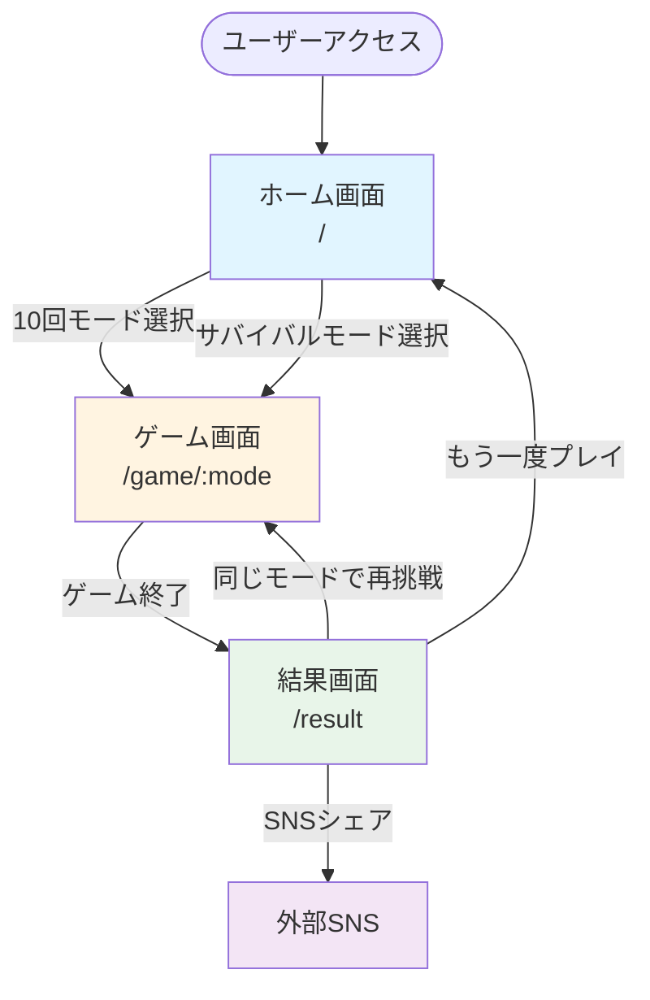

# 05_sitemap.md - サイトマップ・画面遷移設計（修正版 v2.1）

## 概要

**画面数**: 3画面（SPA）  
**ルーティング**: React Router v7  
**ベースパス**: `/coin-toss`（GitHub Pages用）

---

## サイトマップ

```
/coin-toss/
├── /                    # ホーム画面（モード選択）
├── /game/:mode          # ゲーム画面
│   ├── /game/tenRounds  # 10回モード
│   └── /game/survival   # サバイバルモード
└── /result              # 結果画面
```

---

## 画面一覧

| No. | 画面名     | パス          | 説明                       |
| --- | ---------- | ------------- | -------------------------- |
| 1   | ホーム画面 | `/`           | モード選択・ベスト記録表示 |
| 2   | ゲーム画面 | `/game/:mode` | コイントスゲーム本体       |
| 3   | 結果画面   | `/result`     | スコア表示・シェア・広告   |

---

## 画面遷移図



---

## 画面詳細仕様

### 1. ホーム画面（HomePage）

#### パス

```
/
```

#### 目的

- ゲームモードの選択
- 自己ベスト記録の確認
- ゲームへの期待感醸成

#### デザインコンセプト

- **カジノ風の高級感**
- **3D回転するコインのヒーローエリア**
- **シンプルで直感的な導線**

#### 表示要素（修正版）

```
┌─────────────────────────────────────────────┐
│              [グローバルヘッダー]            │
│  🪙 Coin Toss Game                         │
│                    [🌙][🔊] ← 設定トグル   │
└─────────────────────────────────────────────┘

┌─────────────────────────────────────────────┐
│                                             │
│            [ヒーローセクション]              │
│                                             │
│         ⚡ 3D回転するコインアニメ ⚡         │
│              (Framer Motion)                │
│                                             │
│         運を試せ。直感を信じろ。             │
│          Can you predict it?                │
│                                             │
└─────────────────────────────────────────────┘

┌─────────────────────────────────────────────┐
│          [モード選択カードセクション]        │
│                                             │
│  ┌──────────────────┐ ┌──────────────────┐│
│  │   🎯 10回モード   │ │ ⚡ サバイバル   ││
│  │                  │ │                  ││
│  │  [コインアイコン] │ │ [炎アイコン]     ││
│  │                  │ │                  ││
│  │ 10回プレイして   │ │ 外れるまで続ける ││
│  │ 何回当てられる？ │ │ あなたの限界は？ ││
│  │                  │ │                  ││
│  │ 自己ベスト:      │ │ 自己ベスト:      ││
│  │   🏆 8回         │ │   🏆 15連続      ││
│  │                  │ │                  ││
│  │ [PLAY ▶]         │ │ [PLAY ▶]         ││
│  └──────────────────┘ └──────────────────┘│
│                                             │
│       ホバー時: カードが浮く + 光沢          │
│       クリック時: パルスアニメーション        │
└─────────────────────────────────────────────┘

┌─────────────────────────────────────────────┐
│           [トップスコアリーダーボード]       │
│                                             │
│  🏆 あなたのベスト記録                      │
│                                             │
│  ┌─ 10回モード ─────────┐                 │
│  │ 🥇 1位: 10回          │                 │
│  │ 🥈 2位: 9回           │                 │
│  │ 🥉 3位: 8回           │                 │
│  └───────────────────────┘                 │
│                                             │
│  ┌─ サバイバルモード ────┐                 │
│  │ 🥇 1位: 25連続        │                 │
│  │ 🥈 2位: 20連続        │                 │
│  │ 🥉 3位: 15連続        │                 │
│  └───────────────────────┘                 │
│                                             │
│       グラデーション背景 + カードUI          │
└─────────────────────────────────────────────┘

┌─────────────────────────────────────────────┐
│                [フッター]                   │
│         Made with ❤️ by [Your Name]         │
│              v1.0.0 | GitHub                │
└─────────────────────────────────────────────┘
```

#### データソース（LocalStorageのみ）

```typescript
// pages/HomePage.tsx
import { useGameStorage } from "../features/storage/useGameStorage";

export const HomePage = () => {
  const { data } = useGameStorage();

  // 利用可能なデータ
  const tenRoundsBest = data.topScores.tenRounds.at(0)?.score ?? 0;
  const survivalBest = data.topScores.survival.at(0)?.score ?? 0;
  const tenRoundsTop3 = data.topScores.tenRounds; // 最大3件
  const survivalTop3 = data.topScores.survival; // 最大3件

  // これ以上の統計情報は出せない
};
```

#### アニメーション・インタラクション

1. **ヒーローコイン**
   - 常時ゆっくり回転（Framer Motion）
   - ホバー時: 回転速度UP
   - 5秒ごとに自動でフリップアニメーション

2. **モードカード**
   - ホバー時: `translateY(-8px)` + 影を強調
   - クリック時: パルスエフェクト
   - 自己ベストが更新されたら: ✨キラキラエフェクト（次回訪問時）

3. **リーダーボード**
   - スクロールイン時: カードが順番にフェードイン
   - 記録なしの場合: 「まだ記録がありません」と表示

#### 主要コンポーネント

| コンポーネント | 役割                   | パス                         |
| -------------- | ---------------------- | ---------------------------- |
| `HomePage`     | ページ全体             | `pages/HomePage.tsx`         |
| `HeroCoin`     | 3Dコインアニメーション | `features/home/HeroCoin/`    |
| `ModeCard`     | モード選択カード       | `features/mode/ModeCard/`    |
| `LeaderBoard`  | トップスコア表示       | `features/home/LeaderBoard/` |
| `GlobalHeader` | ヘッダー（設定含む）   | `components/GlobalHeader/`   |

#### 状態管理

```typescript
// pages/HomePage.tsx
import { useGameStorage } from "../features/storage/useGameStorage";
import { useDarkMode } from "../hooks/useDarkMode";
import { useSound } from "../hooks/useSound";
import { useNavigate } from "react-router";

export const HomePage = () => {
  const { data } = useGameStorage();
  const { darkMode, toggleDarkMode } = useDarkMode();
  const { soundEnabled, toggleSound } = useSound();
  const navigate = useNavigate();

  const handleSelectMode = (mode: GameMode) => {
    navigate(`/game/${mode}`);
  };

  return (
    <div className="min-h-screen bg-gradient-to-br from-gray-900 via-gray-800 to-black">
      <GlobalHeader
        darkMode={darkMode}
        soundEnabled={soundEnabled}
        onToggleDarkMode={toggleDarkMode}
        onToggleSound={toggleSound}
      />

      <HeroCoin />

      <div className="grid grid-cols-1 md:grid-cols-2 gap-8 max-w-6xl mx-auto px-4">
        <ModeCard
          mode="tenRounds"
          title="🎯 10回モード"
          description="10回プレイして何回当てられる？"
          bestScore={data.topScores.tenRounds.at(0)?.score}
          onSelect={() => handleSelectMode("tenRounds")}
        />

        <ModeCard
          mode="survival"
          title="⚡ サバイバル"
          description="外れるまで続ける。あなたの限界は？"
          bestScore={data.topScores.survival.at(0)?.score}
          onSelect={() => handleSelectMode("survival")}
        />
      </div>

      <LeaderBoard topScores={data.topScores} />
    </div>
  );
};
```

---

### 2. ゲーム画面（GamePage）

#### パス

```
/game/:mode
```

#### デザインコンセプト

- **没入感のあるゲーム体験**
- **カジノテーブルのような背景**
- **リアルタイムフィードバック**

#### 表示要素（修正版）

```
┌─────────────────────────────────────────────┐
│          [ゲームヘッダー]                   │
│  ← 戻る                        [🌙][🔊]    │
│                                             │
│  ┌────────────────────────────────┐        │
│  │  サバイバルモード                │        │
│  │  🔥 現在: 12連続正解 🔥          │        │
│  └────────────────────────────────┘        │
└─────────────────────────────────────────────┘

┌─────────────────────────────────────────────┐
│                                             │
│            [メインゲームエリア]              │
│                                             │
│     ┌─────────────────────────┐            │
│     │                         │            │
│     │   🪙 コイン回転エリア   │            │
│     │                         │            │
│     │   3D回転アニメーション   │            │
│     │   (2秒間)               │            │
│     │                         │            │
│     │   グローエフェクト       │            │
│     │   パーティクル散布       │            │
│     │                         │            │
│     └─────────────────────────┘            │
│                                             │
│  ┌──────────────────────────────────────┐  │
│  │         予想してください              │  │
│  │                                      │  │
│  │  ┌─────────┐       ┌─────────┐     │  │
│  │  │         │       │         │     │  │
│  │  │   表    │       │   裏    │     │  │
│  │  │  HEADS  │       │  TAILS  │     │  │
│  │  │         │       │         │     │  │
│  │  │   🌟    │       │   🌙    │     │  │
│  │  │         │       │         │     │  │
│  │  └─────────┘       └─────────┘     │  │
│  │                                      │  │
│  │   ホバー時: ボタンが脈動              │  │
│  │   選択不可時: グレーアウト            │  │
│  └──────────────────────────────────────┘  │
│                                             │
└─────────────────────────────────────────────┘

┌─────────────────────────────────────────────┐
│           [結果フィードバックエリア]         │
│                                             │
│  ┌────────────────────────────────┐        │
│  │                                │        │
│  │     ✅ 正解！ (表)              │        │
│  │                                │        │
│  │   ┌──────────────────┐         │        │
│  │   │ +1 ポイント      │         │        │
│  │   │ スコア: 12 → 13  │         │        │
│  │   └──────────────────┘         │        │
│  │                                │        │
│  │   🎉 紙吹雪エフェクト           │        │
│  │                                │        │
│  └────────────────────────────────┘        │
│                                             │
│  または                                     │
│                                             │
│  ┌────────────────────────────────┐        │
│  │                                │        │
│  │     ❌ 残念... (裏)             │        │
│  │                                │        │
│  │   ゲーム終了                    │        │
│  │   最終スコア: 12連続            │        │
│  │                                │        │
│  │   画面が揺れる演出              │        │
│  │                                │        │
│  └────────────────────────────────┘        │
│                                             │
└─────────────────────────────────────────────┘

┌─────────────────────────────────────────────┐
│          [連続正解時の特殊演出]             │
│                                             │
│  5連続:  「🔥 Hot Streak!」                 │
│  10連続: 「⚡ Incredible!」                 │
│  15連続: 「🌟 Legendary!」                  │
│  20連続: 「👑 Unstoppable!」                │
│                                             │
│  ポップアップ + 効果音                       │
│  1秒間表示して消える                        │
│                                             │
└─────────────────────────────────────────────┘

┌─────────────────────────────────────────────┐
│               [下部エリア]                  │
│                                             │
│  ┌─────────────────┐                       │
│  │  ⏸️ ギブアップ   │  ← 確認モーダル表示  │
│  └─────────────────┘                       │
│                                             │
└─────────────────────────────────────────────┘
```

#### ゲーム中に保持する状態（useGameLogic）

```typescript
// features/game/useGameLogic.ts
type GameState = {
  mode: GameMode;
  currentRound: number; // 現在のラウンド数
  score: number; // 現在のスコア
  isPlaying: boolean; // プレイ中かどうか
  coinResult: CoinSide | null; // コインの結果
  prediction: CoinSide | null; // ユーザーの予想
  consecutiveCorrect: number; // 連続正解数（ストリーク表示用）
};

// これ以上の統計は保持しない（シンプルに）
```

#### アニメーション・インタラクション

1. **コイン回転**
   - 3D Transform（rotateY: 1800deg）
   - グローエフェクト（発光）
   - パーティクルが周囲に散布

2. **予想ボタン**
   - ホバー時: `scale(1.05)` + 脈動アニメーション
   - クリック時: 選択したボタンが光る
   - 選択不可時: `opacity: 0.3` + `cursor: not-allowed`

3. **結果表示**
   - 正解時:
     - ✅ アイコンがズームイン
     - 紙吹雪エフェクト
     - スコア数字がカウントアップ
     - 効果音: ピロリーン♪
   - 不正解時:
     - ❌ アイコンが揺れる
     - 画面全体が一瞬赤くフラッシュ
     - 効果音: ブー...

4. **連続正解時の特殊演出**
   - 5連続: 「🔥 Hot Streak!」（ポップアップ）
   - 10連続: 「⚡ Incredible!」（ポップアップ + 効果音）
   - 15連続: 「🌟 Legendary!」（ポップアップ + 効果音 + 画面振動）
   - 20連続: 「👑 Unstoppable!」（最大演出）

#### 主要コンポーネント

| コンポーネント       | 役割                   | パス                                |
| -------------------- | ---------------------- | ----------------------------------- |
| `GamePage`           | ページ全体             | `pages/GamePage.tsx`                |
| `CoinFlip3D`         | 3Dコインアニメーション | `features/game/CoinFlip3D/`         |
| `PredictionButton`   | 予想ボタン             | `features/game/PredictionButton/`   |
| `ResultFeedback`     | 結果フィードバック     | `features/game/ResultFeedback/`     |
| `ScoreDisplay`       | スコア表示             | `features/game/ScoreDisplay/`       |
| `StreakNotification` | 連続正解通知           | `features/game/StreakNotification/` |

#### ゲームフロー

```mermaid
sequenceDiagram
    participant User as ユーザー
    participant Game as GamePage
    participant Coin as CoinFlip3D
    participant Logic as useGameLogic
    participant Sound as useSound
    participant Feedback as ResultFeedback

    User->>Game: ゲーム開始
    Game->>Logic: 初期化
    Logic-->>Game: gameState

    loop 各ラウンド
        Game->>Coin: startFlip()
        Coin->>Coin: 2秒間回転アニメーション

        par コイン回転中
            User->>Game: 予想ボタンクリック（表/裏）
            Game->>Game: ボタンを光らせる
        end

        Coin->>Logic: アニメーション完了
        Logic->>Logic: 結果判定
        Logic-->>Coin: 停止（表 or 裏）

        alt 正解
            Logic->>Sound: playCorrectSound()
            Logic->>Feedback: show(正解, newScore)
            Feedback->>Feedback: 紙吹雪エフェクト
            Feedback->>Feedback: スコアカウントアップ

            alt 5の倍数（ストリーク）
                Feedback->>Feedback: ストリーク通知表示
                Sound: playStreakSound()
            end
        else 不正解
            Logic->>Sound: playIncorrectSound()
            Logic->>Feedback: show(不正解, finalScore)
            Feedback->>Feedback: 画面振動

            alt サバイバルモード
                Game->>Game: 結果画面へ遷移（2秒後）
            end
        end
    end
```

---

### 3. 結果画面（ResultPage）

#### パス

```
/result
```

#### デザインコンセプト

- **達成感を最大化**
- **次のプレイへの導線**
- **SNSシェアの促進**

#### 表示要素（修正版）

```
┌─────────────────────────────────────────────┐
│                                             │
│          [結果ヘッダーアニメーション]        │
│                                             │
│  ╔═══════════════════════════════════════╗ │
│  ║                                       ║ │
│  ║       🎊 ゲーム終了！ 🎊              ║ │
│  ║                                       ║ │
│  ║   （新記録時）                        ║ │
│  ║   ┌───────────────────────┐          ║ │
│  ║   │                       │          ║ │
│  ║   │   👑 NEW RECORD! 👑   │          ║ │
│  ║   │                       │          ║ │
│  ║   │   紙吹雪 + 王冠回転    │          ║ │
│  ║   │   効果音: ファンファーレ│          ║ │
│  ║   │                       │          ║ │
│  ║   └───────────────────────┘          ║ │
│  ║                                       ║ │
│  ╚═══════════════════════════════════════╝ │
│                                             │
└─────────────────────────────────────────────┘

┌─────────────────────────────────────────────┐
│           [スコアカードセクション]           │
│                                             │
│  ┌────────────────────────────────┐        │
│  │                                │        │
│  │      サバイバルモード            │        │
│  │                                │        │
│  │   ┌──────────────────┐         │        │
│  │   │                  │         │        │
│  │   │    今回のスコア   │         │        │
│  │   │                  │         │        │
│  │   │       15         │         │        │
│  │   │     連続正解      │         │        │
│  │   │                  │         │        │
│  │   │   大きく表示      │         │        │
│  │   │   カウントアップ  │         │        │
│  │   │                  │         │        │
│  │   └──────────────────┘         │        │
│  │                                │        │
│  │   自己ベスト: 20連続            │        │
│  │   ┌──────────────────┐         │        │
│  │   │ ████████░░░ 75%  │         │        │
│  │   └──────────────────┘         │        │
│  │                                │        │
│  └────────────────────────────────┘        │
│                                             │
└─────────────────────────────────────────────┘

┌─────────────────────────────────────────────┐
│           [トップスコア比較]                │
│                                             │
│  🏆 あなたのベスト3                         │
│                                             │
│  ┌───────────────────────────────┐         │
│  │                               │         │
│  │  🥇 1位: 20連続               │         │
│  │  🥈 2位: 15連続 ← NEW!        │         │
│  │  🥉 3位: 12連続               │         │
│  │                               │         │
│  │  新記録の行: 脈動アニメーション │         │
│  │                               │         │
│  └───────────────────────────────┘         │
│                                             │
└─────────────────────────────────────────────┘

┌─────────────────────────────────────────────┐
│          [SNSシェアセクション]              │
│                                             │
│  結果をシェアして友達に挑戦状を送ろう！      │
│                                             │
│  ┌─────────────────────────────────────┐  │
│  │                                     │  │
│  │  🪙 コイントス予想ゲーム             │  │
│  │  サバイバルモードで15連続正解！      │  │
│  │  自己ベスト：20連続                 │  │
│  │  #コイントスゲーム #暇つぶし        │  │
│  │  https://...                        │  │
│  │                                     │  │
│  └─────────────────────────────────────┘  │
│                                             │
│  ┌──────┐ ┌──────┐ ┌──────┐ ┌──────┐    │
│  │ LINE │ │  X   │ │Thread│ │ Copy │    │
│  │ 📱   │ │ 🐦   │ │  📷  │ │ 📋   │    │
│  └──────┘ └──────┘ └──────┘ └──────┘    │
│                                             │
│  ボタン: グラデーション + ホバーエフェクト   │
│                                             │
└─────────────────────────────────────────────┘

┌─────────────────────────────────────────────┐
│             [広告セクション]                │
│                                             │
│  ┌─────────────────────────────────────┐  │
│  │                                     │  │
│  │       Google AdSense               │  │
│  │       レスポンシブ広告              │  │
│  │                                     │  │
│  │  エラー時: 「広告欄」プレースホルダー│  │
│  │                                     │  │
│  └─────────────────────────────────────┘  │
│                                             │
└─────────────────────────────────────────────┘

┌─────────────────────────────────────────────┐
│          [アクションボタンセクション]        │
│                                             │
│  ┌──────────────────────────────────┐      │
│  │                                  │      │
│  │    🏠 ホームに戻る                │      │
│  │                                  │      │
│  │  ボタン: グラデーション背景       │      │
│  │  ホバー時: 浮く                  │      │
│  │                                  │      │
│  └──────────────────────────────────┘      │
│                                             │
│  ┌──────────────────────────────────┐      │
│  │                                  │      │
│  │    🔄 同じモードで再挑戦          │      │
│  │                                  │      │
│  │  ボタン: アウトライン             │      │
│  │  ホバー時: 背景色変化             │      │
│  │                                  │      │
│  └──────────────────────────────────┘      │
│                                             │
└─────────────────────────────────────────────┘

┌─────────────────────────────────────────────┐
│            [モチベーションメッセージ]        │
│                                             │
│  ┌─────────────────────────────────────┐  │
│  │                                     │  │
│  │   スコアに応じたメッセージ表示       │  │
│  │                                     │  │
│  │   0-3:   "次は勝てる！"             │  │
│  │   4-6:   "いい調子！"               │  │
│  │   7-8:   "素晴らしい！"             │  │
│  │   9-10:  "ほぼ完璧！"               │  │
│  │   (サバイバルも同様)                │  │
│  │                                     │  │
│  └─────────────────────────────────────┘  │
│                                             │
└─────────────────────────────────────────────┘
```

#### データソース（React Router state + LocalStorage）

```typescript
// pages/ResultPage.tsx
import { useLocation, Navigate } from "react-router";
import { GameResultSchema } from "../features/result/result.schema";
import { useGameStorage } from "../features/storage/useGameStorage";

export const ResultPage = () => {
  const location = useLocation();
  const { data } = useGameStorage();

  // React Router の state から結果取得
  const parseResult = () => {
    try {
      return GameResultSchema.parse(location.state);
    } catch {
      return null;
    }
  };

  const result = parseResult();

  if (!result) {
    return <Navigate to="/" replace />;
  }

  // 利用可能なデータ
  const currentScore = result.score;           // 今回のスコア
  const isNewRecord = result.isNewRecord;      // 新記録かどうか
  const rank = result.rank;                    // 順位（1, 2, 3 or null）
  const previousBest = result.previousBest;    // 以前のベスト
  const topScores = data.topScores[result.mode]; // トップ3

  // これ以上の統計情報は出せない
};
```

#### アニメーション・インタラクション

1. **新記録アニメーション**
   - 王冠が回転しながらズームイン
   - 紙吹雪が上から降る（50個のパーティクル）
   - 背景がキラキラ光る
   - 効果音: ファンファーレ（3音階）
   - 表示時間: 3秒間

2. **スコアカウントアップ**
   - 0から最終スコアまで0.5秒でカウント
   - イージング: easeOut

3. **プログレスバー**
   - 左から右へ1秒かけてアニメーション
   - ベストスコアに対する割合を表示

4. **シェアボタン**
   - ホバー時: `scale(1.1)` + グラデーション移動
   - クリック時: リップルエフェクト

5. **アクションボタン**
   - ホバー時: `translateY(-4px)` + 影を濃く

#### 主要コンポーネント

| コンポーネント        | 役割                     | パス                                   |
| --------------------- | ------------------------ | -------------------------------------- |
| `ResultPage`          | ページ全体               | `pages/ResultPage.tsx`                 |
| `NewRecordAnimation`  | 新記録演出               | `features/result/NewRecordAnimation/`  |
| `ScoreCard`           | スコアカード             | `features/result/ScoreCard/`           |
| `TopScoresComparison` | ベスト記録比較           | `features/result/TopScoresComparison/` |
| `ShareSection`        | シェアセクション         | `features/result/ShareSection/`        |
| `MotivationMessage`   | モチベーションメッセージ | `features/result/MotivationMessage/`   |
| `AdPlaceholder`       | 広告表示                 | `components/AdPlaceholder/`            |

#### スコア別メッセージ定義

```typescript
// features/result/motivationMessages.ts
const MOTIVATION_MESSAGES = {
  tenRounds: {
    low: {
      range: [0, 3],
      messages: ["次は勝てる！運は巡ってくる 🎲", "まだまだこれから！🔥"],
    },
    medium: {
      range: [4, 6],
      messages: ["いい調子！半分以上当てたね 🎯", "まずまずの結果！👍"],
    },
    high: {
      range: [7, 8],
      messages: ["素晴らしい！かなり勘がいい 🌟", "センス抜群！⚡"],
    },
    perfect: {
      range: [9, 10],
      messages: ["ほぼ完璧！予知能力者？ 🔮", "パーフェクト！伝説の予想師 👑"],
    },
  },
  survival: {
    low: {
      range: [0, 5],
      messages: ["ウォーミングアップ完了！🔥", "次はもっと行ける！💪"],
    },
    medium: {
      range: [6, 10],
      messages: ["いい調子！集中力が光る ✨", "素晴らしい直感力！🎯"],
    },
    high: {
      range: [11, 20],
      messages: ["驚異的な集中力！🌟", "天才的な予想力！⚡"],
    },
    legendary: {
      range: [21, Infinity],
      messages: ["伝説級！あなたは予言者 🔮", "神の領域...！👑"],
    },
  },
} as const;

export const getMotivationMessage = (mode: GameMode, score: number): string => {
  const modeMessages = MOTIVATION_MESSAGES[mode];

  for (const [_, category] of Object.entries(modeMessages)) {
    const [min, max] = category.range;
    if (score >= min && score <= max) {
      const messages = category.messages;
      return messages[Math.floor(Math.random() * messages.length)];
    }
  }

  return "お疲れ様！🎊";
};
```

---

## ルーティング設定（React Router v7）

### ファイル: `app/routes.ts`

```typescript
import { type RouteConfig, index, route } from "@react-router/dev/routes";

export default [
  index("routes/home.tsx"),
  route("game/:mode", "routes/game.tsx"),
  route("result", "routes/result.tsx"),
] satisfies RouteConfig;
```

### ファイル: `app/root.tsx`

```typescript
import {
  Links,
  Meta,
  Outlet,
  Scripts,
  ScrollRestoration,
} from "react-router";

export default function Root() {
  return (
    <html lang="ja">
      <head>
        <meta charSet="utf-8" />
        <meta name="viewport" content="width=device-width, initial-scale=1" />
        <Meta />
        <Links />
      </head>
      <body>
        <Outlet />
        <ScrollRestoration />
        <Scripts />
      </body>
    </html>
  );
}
```

### ファイル: `app/routes/home.tsx`

```typescript
import type { Route } from "./+types/home";
import { HomePage } from "../pages/HomePage";

export function meta({}: Route.MetaArgs) {
  return [
    { title: "コイントス予想ゲーム" },
    { name: "description", content: "連続で何回当てられる？" },
  ];
}

export default function Home() {
  return <HomePage />;
}
```

### ファイル: `app/routes/game.tsx`

```typescript
import type { Route } from "./+types/game";
import { GamePage } from "../pages/GamePage";
import { redirect } from "react-router";
import { GameModeSchema } from "../features/game/game.schema";
import { MODE_NAMES } from "../consts/game";

export function meta({ params }: Route.MetaArgs) {
  const modeName = MODE_NAMES[params.mode as keyof typeof MODE_NAMES] ?? "不明";
  return [
    { title: `${modeName} | コイントス予想ゲーム` },
  ];
}

export async function loader({ params }: Route.LoaderArgs) {
  // パラメータバリデーション
  try {
    GameModeSchema.parse(params.mode);
    return null;
  } catch {
    throw redirect("/");
  }
}

export default function Game() {
  return <GamePage />;
}
```

### ファイル: `app/routes/result.tsx`

```typescript
import type { Route } from "./+types/result";
import { ResultPage } from "../pages/ResultPage";

export function meta({}: Route.MetaArgs) {
  return [
    { title: "結果 | コイントス予想ゲーム" },
  ];
}

export default function Result() {
  return <ResultPage />;
}
```

---

## カラースキーム詳細

### ダークモード（デフォルト）

```typescript
// tailwind.config.js
export default {
  theme: {
    extend: {
      colors: {
        // カジノ風ダークテーマ
        casino: {
          black: "#0a0a0a",
          darkGray: "#1a1a1a",
          gray: "#2a2a2a",
          gold: "#d4af37",
          lightGold: "#f4d03f",
          green: "#1b5e20",
          darkGreen: "#0d3818",
        },
        // アクセントカラー
        accent: {
          success: "#4caf50",
          error: "#f44336",
          warning: "#ff9800",
          info: "#2196f3",
        },
      },
      backgroundImage: {
        "casino-gradient":
          "linear-gradient(135deg, #0a0a0a 0%, #1a1a1a 50%, #0d3818 100%)",
        "gold-gradient": "linear-gradient(135deg, #d4af37 0%, #f4d03f 100%)",
        "card-gradient": "linear-gradient(145deg, #1a1a1a 0%, #2a2a2a 100%)",
      },
      boxShadow: {
        "glow-gold": "0 0 20px rgba(212, 175, 55, 0.3)",
        "glow-green": "0 0 20px rgba(27, 94, 32, 0.3)",
        card: "0 8px 32px rgba(0, 0, 0, 0.4)",
        "card-hover": "0 12px 48px rgba(0, 0, 0, 0.6)",
      },
    },
  },
};
```

### ライトモード

```typescript
// ライトモード用カラー
lightMode: {
  offWhite: "#f5f5f5",
  champagneGold: "#e8d5b7",
  lightGray: "#e0e0e0",
  darkText: "#212121",
}
```

---

## パフォーマンス最適化

### 画像・アセット最適化

```typescript
// vite.config.ts
export default {
  build: {
    rollupOptions: {
      output: {
        manualChunks: {
          "framer-motion": ["framer-motion"],
          "react-router": ["react-router"],
        },
      },
    },
  },
  optimizeDeps: {
    include: ["framer-motion", "react-router"],
  },
};
```

### 遅延ロード

```typescript
// app/routes/game.tsx
import { lazy } from "react";

const CoinFlip3D = lazy(() => import("../features/game/CoinFlip3D"));
```

---

## アクセシビリティ

### キーボード操作

```typescript
// features/game/PredictionButton.tsx
<button
  onKeyDown={(e) => {
    if (e.key === "Enter" || e.key === " ") {
      handlePredict("heads");
    }
  }}
  aria-label="表を予想"
>
  表
</button>
```

### ARIA属性

```typescript
<div role="status" aria-live="polite">
  {result && `結果: ${result}`}
</div>
```

---

## 関連ファイル

| ファイル                | 役割                 |
| ----------------------- | -------------------- |
| `app/routes.ts`         | ルート定義（v7）     |
| `app/root.tsx`          | ルートコンポーネント |
| `app/routes/home.tsx`   | ホーム画面           |
| `app/routes/game.tsx`   | ゲーム画面           |
| `app/routes/result.tsx` | 結果画面             |
| `tailwind.config.ts`    | カラースキーム定義   |
| `public/robots.txt`     | クローラー制御       |
| `public/sitemap.xml`    | サイトマップ         |

---

**作成日**: 2025年  
**バージョン**: 2.1
