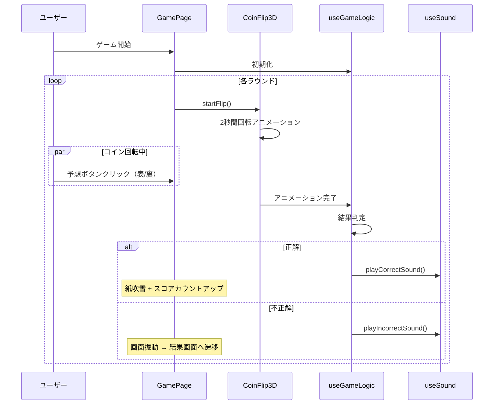

# 05_sitemap.md - サイトマップ・画面遷移設計

## 概要

**画面数**: 3画面（SPA）
**ルーティング**: React Router v7
**ベースパス**: `/coin-toss-game/`（GitHub Pages用）

> ルーティング実装は `src/AppRouter.tsx` を参照。

---

## サイトマップ

```
/coin-toss-game/
├── /                    # ホーム画面（モード選択）
├── /game/:mode          # ゲーム画面
│   ├── /game/tenRounds  # 10回モード
│   └── /game/survival   # サバイバルモード
├── /result              # 結果画面
└── /*                   # 不正なパスはホームにリダイレクト
```

---

## 画面一覧

| No. | 画面名     | パス          | 説明                       |
| --- | ---------- | ------------- | -------------------------- |
| 1   | ホーム画面 | `/`           | モード選択・ベスト記録表示 |
| 2   | ゲーム画面 | `/game/:mode` | コイントスゲーム本体       |
| 3   | 結果画面   | `/result`     | スコア表示・シェア・広告   |

---

## 画面遷移図


---

## 画面詳細仕様

### 1. ホーム画面（HomePage）

#### パス・目的

- **パス**: `/`
- **目的**: ゲームモードの選択、自己ベスト記録の確認、ゲームへの期待感醸成

#### デザインコンセプト

- カジノ風の高級感
- 3D回転するコインのヒーローエリア
- シンプルで直感的な導線

#### ワイヤーフレーム

```
┌─────────────────────────────────────────────┐
│              [グローバルヘッダー]            │
│  🪙 Coin Toss Game                         │
│                    [🌙][🔊] ← 設定トグル   │
└─────────────────────────────────────────────┘

┌─────────────────────────────────────────────┐
│            [ヒーローセクション]              │
│         ⚡ 3D回転するコインアニメ ⚡         │
│         運を試せ。直感を信じろ。             │
└─────────────────────────────────────────────┘

┌─────────────────────────────────────────────┐
│          [モード選択カードセクション]        │
│  ┌──────────────────┐ ┌──────────────────┐│
│  │   🎯 10回モード   │ │ ⚡ サバイバル   ││
│  │ 10回プレイして   │ │ 外れるまで続ける ││
│  │ 何回当てられる？ │ │ あなたの限界は？ ││
│  │ 自己ベスト: 🏆 8  │ │ 自己ベスト: 🏆 15││
│  │ [PLAY ▶]         │ │ [PLAY ▶]         ││
│  └──────────────────┘ └──────────────────┘│
└─────────────────────────────────────────────┘

┌─────────────────────────────────────────────┐
│           [トップスコアリーダーボード]       │
│  🏆 あなたのベスト記録                      │
│  ┌─ 10回モード ─────┐ ┌─ サバイバル ────┐│
│  │ 🥇 1位: 10回      │ │ 🥇 1位: 25連続  ││
│  │ 🥈 2位: 9回       │ │ 🥈 2位: 20連続  ││
│  │ 🥉 3位: 8回       │ │ 🥉 3位: 15連続  ││
│  └───────────────────┘ └────────────────┘│
└─────────────────────────────────────────────┘

┌─────────────────────────────────────────────┐
│                [フッター]                   │
│         Made with ❤️ by [Your Name]         │
└─────────────────────────────────────────────┘
```

#### データソース

- LocalStorage から `useGameStorage` フック経由で取得
- 利用可能: 各モードのトップ3スコア、ベストスコア

#### アニメーション・インタラクション

1. **ヒーローコイン**: 常時ゆっくり回転、ホバー時速度UP、5秒ごと自動フリップ
2. **モードカード**: ホバー時 `translateY(-8px)` + 影強調、クリック時パルスエフェクト
3. **リーダーボード**: スクロールイン時カードが順番にフェードイン

#### 主要コンポーネント

| コンポーネント | 役割                   | パス                             |
| -------------- | ---------------------- | -------------------------------- |
| `HomePage`     | ページ全体             | `src/pages/HomePage.tsx`         |
| `HeroCoin`     | 3Dコインアニメーション | `src/features/home/HeroCoin/`    |
| `ModeCard`     | モード選択カード       | `src/features/mode/ModeCard/`    |
| `LeaderBoard`  | トップスコア表示       | `src/features/home/LeaderBoard/` |
| `GlobalHeader` | ヘッダー（設定含む）   | `src/components/GlobalHeader/`   |

---

### 2. ゲーム画面（GamePage）

#### パス・デザインコンセプト

- **パス**: `/game/:mode`
- **コンセプト**: 没入感のあるゲーム体験、カジノテーブルのような背景、リアルタイムフィードバック

#### ワイヤーフレーム

```
┌─────────────────────────────────────────────┐
│          [ゲームヘッダー]                   │
│  ← 戻る                        [🌙][🔊]    │
│  サバイバルモード 🔥 現在: 12連続正解 🔥     │
└─────────────────────────────────────────────┘

┌─────────────────────────────────────────────┐
│            [メインゲームエリア]              │
│     ┌─────────────────────────┐            │
│     │   🪙 コイン回転エリア   │            │
│     │   3D回転アニメーション   │            │
│     │   (2秒間)               │            │
│     └─────────────────────────┘            │
│                                             │
│  ┌──────────────────────────────────────┐  │
│  │         予想してください              │  │
│  │  ┌─────────┐       ┌─────────┐     │  │
│  │  │   表    │       │   裏    │     │  │
│  │  │  HEADS  │       │  TAILS  │     │  │
│  │  └─────────┘       └─────────┘     │  │
│  └──────────────────────────────────────┘  │
└─────────────────────────────────────────────┘

┌─────────────────────────────────────────────┐
│           [結果フィードバックエリア]         │
│  ✅ 正解！ → +1ポイント、紙吹雪            │
│  ❌ 残念... → ゲーム終了、画面揺れ          │
└─────────────────────────────────────────────┘

┌─────────────────────────────────────────────┐
│          [連続正解時の特殊演出]             │
│  5連続:  「🔥 Hot Streak!」                 │
│  10連続: 「⚡ Incredible!」                 │
│  15連続: 「🌟 Legendary!」                  │
│  20連続: 「👑 Unstoppable!」                │
└─────────────────────────────────────────────┘

┌─────────────────────────────────────────────┐
│  ┌─────────────────┐                       │
│  │  ⏸️ ギブアップ   │  ← 確認モーダル表示  │
│  └─────────────────┘                       │
└─────────────────────────────────────────────┘
```

#### ゲーム中の状態

> 状態の型定義は `src/features/game/game.schema.ts` の `GameStateSchema` を参照。

- `mode`: ゲームモード
- `currentRound`: 現在のラウンド数
- `score`: 現在のスコア
- `isPlaying`: プレイ中かどうか
- `coinResult`: コインの結果（表/裏/null）
- `prediction`: ユーザーの予想（表/裏/null）
- `consecutiveCorrect`: 連続正解数（ストリーク表示用）

#### アニメーション・インタラクション

1. **コイン回転**: 3D Transform（rotateY: 1800deg）+ グローエフェクト + パーティクル散布
2. **予想ボタン**: ホバー時 `scale(1.05)` + 脈動、クリック時発光、選択不可時 `opacity: 0.3`
3. **結果表示（正解）**: ズームイン + 紙吹雪 + スコアカウントアップ + 効果音
4. **結果表示（不正解）**: 揺れ + 赤フラッシュ + 効果音
5. **連続正解演出**: 5の倍数でポップアップ + 効果音（1秒間表示）

#### 主要コンポーネント

| コンポーネント       | 役割                   | パス                                    |
| -------------------- | ---------------------- | --------------------------------------- |
| `GamePage`           | ページ全体             | `src/pages/GamePage.tsx`                |
| `CoinFlip3D`         | 3Dコインアニメーション | `src/features/game/CoinFlip3D/`         |
| `PredictionButton`   | 予想ボタン             | `src/features/game/PredictionButton/`   |
| `ResultFeedback`     | 結果フィードバック     | `src/features/game/ResultFeedback/`     |
| `ScoreDisplay`       | スコア表示             | `src/features/game/ScoreDisplay/`       |
| `StreakNotification` | 連続正解通知           | `src/features/game/StreakNotification/` |

#### ゲームフロー



---

### 3. 結果画面（ResultPage）

#### パス・デザインコンセプト

- **パス**: `/result`
- **コンセプト**: 達成感を最大化、次のプレイへの導線、SNSシェアの促進

#### データソース

- **React Router state**: 今回のスコア、新記録フラグ、順位、以前のベスト
- **LocalStorage**: トップ3スコア一覧

> 状態の型定義は `src/features/result/result.schema.ts` の `GameResultSchema` を参照。

#### ワイヤーフレーム

```
┌─────────────────────────────────────────────┐
│          [結果ヘッダーアニメーション]        │
│       🎊 ゲーム終了！ 🎊                    │
│   （新記録時: 👑 NEW RECORD! 👑 + 紙吹雪）  │
└─────────────────────────────────────────────┘

┌─────────────────────────────────────────────┐
│           [スコアカードセクション]           │
│      サバイバルモード                        │
│           今回のスコア: 15 連続正解          │
│      自己ベスト: 20連続 [プログレスバー 75%] │
└─────────────────────────────────────────────┘

┌─────────────────────────────────────────────┐
│           [トップスコア比較]                │
│  🏆 あなたのベスト3                         │
│  🥇 1位: 20連続                             │
│  🥈 2位: 15連続 ← NEW!（脈動アニメ）       │
│  🥉 3位: 12連続                             │
└─────────────────────────────────────────────┘

┌─────────────────────────────────────────────┐
│          [SNSシェアセクション]              │
│  結果をシェアして友達に挑戦状を送ろう！      │
│  [LINE] [X] [Threads] [Copy]               │
└─────────────────────────────────────────────┘

┌─────────────────────────────────────────────┐
│             [広告セクション]                │
│       Google AdSense レスポンシブ広告       │
└─────────────────────────────────────────────┘

┌─────────────────────────────────────────────┐
│  [🏠 ホームに戻る]  [🔄 同じモードで再挑戦] │
└─────────────────────────────────────────────┘

┌─────────────────────────────────────────────┐
│   [スコアに応じたモチベーションメッセージ]   │
└─────────────────────────────────────────────┘
```

#### スコア別メッセージ

| モード     | スコア範囲 | メッセージ例               |
| ---------- | ---------- | -------------------------- |
| 10回       | 0-3        | "次は勝てる！"             |
| 10回       | 4-6        | "いい調子！"               |
| 10回       | 7-8        | "素晴らしい！"             |
| 10回       | 9-10       | "ほぼ完璧！"               |
| サバイバル | 0-5        | "ウォーミングアップ完了！" |
| サバイバル | 6-10       | "いい調子！集中力が光る"   |
| サバイバル | 11-20      | "驚異的な集中力！"         |
| サバイバル | 21+        | "伝説級！あなたは予言者"   |

> 実装は `src/features/result/MotivationMessage/MotivationMessage.tsx` を参照。

#### アニメーション・インタラクション

1. **新記録アニメーション**: 王冠回転ズームイン + 紙吹雪（3秒間）+ ファンファーレ
2. **スコアカウントアップ**: 0から最終スコアまで0.5秒（easeOut）
3. **プログレスバー**: 左→右へ1秒でアニメーション
4. **シェアボタン**: ホバー時 `scale(1.1)` + グラデーション移動、クリック時リップル
5. **アクションボタン**: ホバー時 `translateY(-4px)` + 影を濃く

#### 主要コンポーネント

| コンポーネント        | 役割                     | パス                                       |
| --------------------- | ------------------------ | ------------------------------------------ |
| `ResultPage`          | ページ全体               | `src/pages/ResultPage.tsx`                 |
| `NewRecordAnimation`  | 新記録演出               | `src/features/result/NewRecordAnimation/`  |
| `ScoreCard`           | スコアカード             | `src/features/result/ScoreCard/`           |
| `TopScoresComparison` | ベスト記録比較           | `src/features/result/TopScoresComparison/` |
| `ShareSection`        | シェアセクション         | `src/features/result/ShareSection/`        |
| `MotivationMessage`   | モチベーションメッセージ | `src/features/result/MotivationMessage/`   |
| `AdPlaceholder`       | 広告表示                 | `src/components/AdPlaceholder/`            |

---

## カラースキーム

> 実装は `tailwind.config.ts` を参照。

### ダークモード（デフォルト）

- **背景**: カジノ風グラデーション（#0a0a0a → #1a1a1a → #0d3818）
- **アクセント**: ゴールド（#d4af37）、ライトゴールド（#f4d03f）
- **テーブルグリーン**: #1b5e20
- **成功/エラー**: #4caf50 / #f44336

### ライトモード

- **背景**: オフホワイト（#f5f5f5）
- **アクセント**: シャンパンゴールド（#e8d5b7）

---

## アクセシビリティ

- **キーボード操作**: 予想ボタンは Enter / Space で操作可能（`aria-label` 付与）
- **ARIA属性**: 結果表示エリアに `role="status"` + `aria-live="polite"`
- **フォーカス管理**: Tab 順序の適切な設定

---

## 関連ファイル

| ファイル                   | 役割                        |
| -------------------------- | --------------------------- |
| `src/AppRouter.tsx`        | ルート定義（BrowserRouter） |
| `src/pages/HomePage.tsx`   | ホーム画面                  |
| `src/pages/GamePage.tsx`   | ゲーム画面                  |
| `src/pages/ResultPage.tsx` | 結果画面                    |
| `tailwind.config.ts`       | カラースキーム定義          |

---

**作成日**: 2025年
**バージョン**: 3.0
