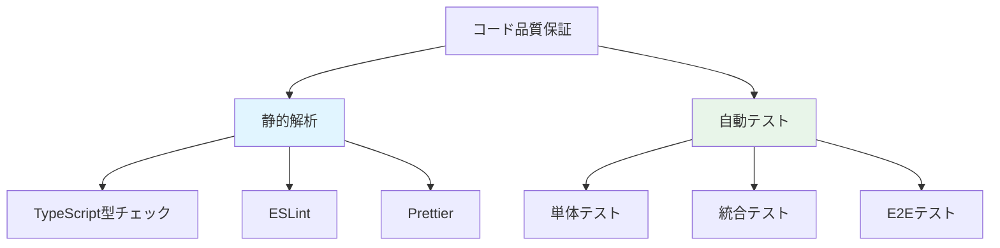
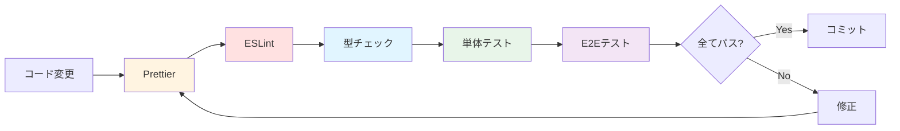
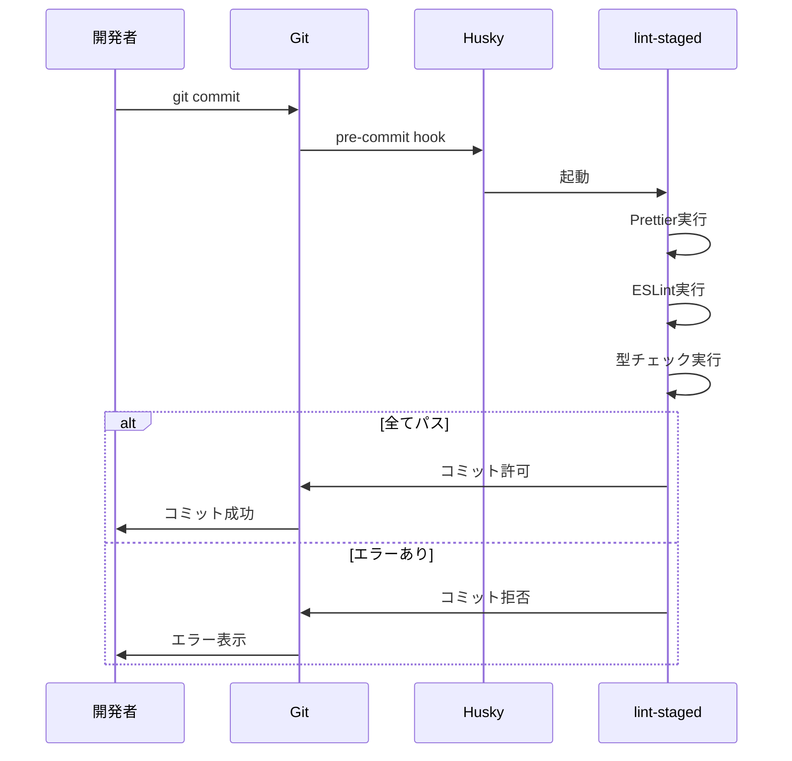
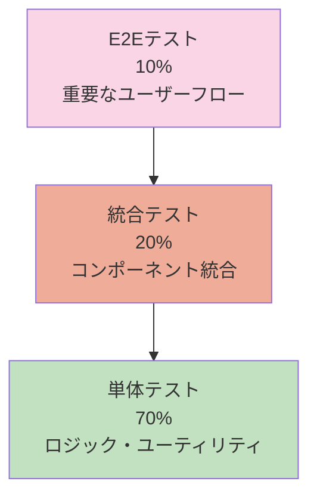

# 06_testing.md - テスト設計（修正版）

## 概要

**テスト方針**: 個人開発プロジェクトとして、保守コストを抑えつつ品質を担保  
**優先順位**: 重要な機能 > UI/UX > エッジケース  
**自動化レベル**: CI/CD で自動実行（GitHub Actions）

---

## テスト戦略

### 品質保証の多層防御



### テスト＆静的解析の実行順序



---

## 静的解析ツール

### 1. TypeScript（型チェック）

#### 目的

- コンパイル時の型安全性保証
- 実行前にバグを検出

#### 設定ファイル: `tsconfig.json`

```json
{
  "compilerOptions": {
    "target": "ES2020",
    "useDefineForClassFields": true,
    "lib": ["ES2020", "DOM", "DOM.Iterable"],
    "module": "ESNext",
    "skipLibCheck": true,

    /* Bundler mode */
    "moduleResolution": "bundler",
    "allowImportingTsExtensions": true,
    "resolveJsonModule": true,
    "isolatedModules": true,
    "noEmit": true,
    "jsx": "react-jsx",

    /* Linting */
    "strict": true,
    "noUnusedLocals": true,
    "noUnusedParameters": true,
    "noFallthroughCasesInSwitch": true,
    "noUncheckedIndexedAccess": true,
    "noImplicitReturns": true,
    "forceConsistentCasingInFileNames": true
  },
  "include": ["src"],
  "references": [{ "path": "./tsconfig.node.json" }]
}
```

#### 実行コマンド

```bash
# 型チェック
pnpm type-check

# ファイル変更を監視
pnpm type-check:watch
```

#### package.json

```json
{
  "scripts": {
    "type-check": "tsc --noEmit",
    "type-check:watch": "tsc --noEmit --watch"
  }
}
```

---

### 2. ESLint（リンター）

#### 目的

- コードの問題を自動検出
- ベストプラクティスの強制
- バグの早期発見

#### 設定ファイル: `eslint.config.js`

```javascript
import js from "@eslint/js";
import globals from "globals";
import reactHooks from "eslint-plugin-react-hooks";
import reactRefresh from "eslint-plugin-react-refresh";
import tseslint from "typescript-eslint";

export default tseslint.config(
  { ignores: ["dist"] },
  {
    extends: [js.configs.recommended, ...tseslint.configs.strictTypeChecked],
    files: ["**/*.{ts,tsx}"],
    languageOptions: {
      ecmaVersion: 2020,
      globals: globals.browser,
      parserOptions: {
        project: ["./tsconfig.json", "./tsconfig.node.json"],
        tsconfigRootDir: import.meta.dirname,
      },
    },
    plugins: {
      "react-hooks": reactHooks,
      "react-refresh": reactRefresh,
    },
    rules: {
      ...reactHooks.configs.recommended.rules,
      "react-refresh/only-export-components": [
        "warn",
        { allowConstantExport: true },
      ],

      // カスタムルール
      "@typescript-eslint/no-unused-vars": [
        "error",
        {
          argsIgnorePattern: "^_",
          varsIgnorePattern: "^_",
        },
      ],
      "@typescript-eslint/consistent-type-imports": [
        "error",
        {
          prefer: "type-imports",
        },
      ],
      "@typescript-eslint/no-floating-promises": "error",
      "@typescript-eslint/no-misused-promises": "error",
      "no-console": ["warn", { allow: ["warn", "error"] }],
    },
  },
);
```

#### 実行コマンド

```bash
# リント実行
pnpm lint

# 自動修正
pnpm lint:fix
```

#### package.json

```json
{
  "scripts": {
    "lint": "eslint .",
    "lint:fix": "eslint . --fix"
  },
  "devDependencies": {
    "@eslint/js": "^9.0.0",
    "eslint": "^9.0.0",
    "eslint-plugin-react-hooks": "^5.0.0",
    "eslint-plugin-react-refresh": "^0.4.0",
    "typescript-eslint": "^8.0.0",
    "globals": "^15.0.0"
  }
}
```

---

### 3. Prettier（フォーマッター）

#### 目的

- コードスタイルの統一
- フォーマットに関する議論を排除
- 可読性の向上

#### 設定ファイル: `.prettierrc`

```json
{
  "semi": true,
  "trailingComma": "es5",
  "singleQuote": false,
  "printWidth": 80,
  "tabWidth": 2,
  "useTabs": false,
  "arrowParens": "always",
  "endOfLine": "lf",
  "plugins": ["prettier-plugin-tailwindcss"]
}
```

#### 設定ファイル: `.prettierignore`

```
# ビルド成果物
dist
build
coverage

# 依存関係
node_modules

# 設定ファイル
package-lock.json
pnpm-lock.yaml
```

#### 実行コマンド

```bash
# フォーマットチェック
pnpm format:check

# 自動フォーマット
pnpm format
```

#### package.json

```json
{
  "scripts": {
    "format": "prettier --write \"src/**/*.{ts,tsx,css}\"",
    "format:check": "prettier --check \"src/**/*.{ts,tsx,css}\""
  },
  "devDependencies": {
    "prettier": "^3.2.0",
    "prettier-plugin-tailwindcss": "^0.5.0"
  }
}
```

---

## Git Hooks（Husky + lint-staged）

### 目的

- コミット前に自動チェック
- 不正なコードのコミットを防止

### セットアップ

```bash
# Husky と lint-staged をインストール
pnpm add -D husky lint-staged
pnpm exec husky init
```

### 設定ファイル: `.husky/pre-commit`

```bash
#!/usr/bin/env sh
. "$(dirname -- "$0")/_/husky.sh"

pnpm exec lint-staged
```

### 設定ファイル: `package.json`

```json
{
  "lint-staged": {
    "*.{ts,tsx}": [
      "prettier --write",
      "eslint --fix",
      "bash -c 'pnpm type-check'"
    ],
    "*.{css,md,json}": ["prettier --write"]
  }
}
```

### 実行フロー



---

## テストピラミッド



---

## テスト技術スタック

| 種類           | ツール                | 用途                     |
| -------------- | --------------------- | ------------------------ |
| 型チェック     | TypeScript            | コンパイル時の型安全性   |
| リンター       | ESLint                | コード品質・バグ検出     |
| フォーマッター | Prettier              | コードスタイル統一       |
| Git Hooks      | Husky + lint-staged   | コミット前自動チェック   |
| 単体テスト     | Vitest                | ロジック・ユーティリティ |
| 統合テスト     | React Testing Library | コンポーネント統合       |
| E2Eテスト      | Playwright            | ユーザーフロー           |
| モック         | Vitest Mock           | LocalStorage、外部API    |
| カバレッジ     | Vitest Coverage (c8)  | コードカバレッジ測定     |
| CI/CD          | GitHub Actions        | 自動テスト実行           |

---

## 単体テスト（Unit Tests）

### 対象

- ユーティリティ関数
- カスタムフック（ロジックのみ）
- Zodスキーマ
- サービス層（副作用を含む）

### テストファイル配置

```
src/
├── utils/
│   ├── coinFlip.ts
│   └── coinFlip.test.ts          # ユーティリティのテスト
├── features/
│   ├── storage/
│   │   ├── storage.schema.ts
│   │   ├── storage.schema.test.ts  # Zodスキーマのテスト
│   │   ├── useGameStorage.ts
│   │   └── useGameStorage.test.ts  # カスタムフックのテスト
│   └── game/
│       ├── useGameLogic.ts
│       └── useGameLogic.test.ts
└── services/
    ├── share.service.ts
    └── share.service.test.ts       # サービスのテスト
```

---

### 1. ユーティリティ関数のテスト

#### ファイル: `utils/coinFlip.test.ts`

```typescript
import { describe, it, expect } from "vitest";
import { flipCoin } from "./coinFlip";

describe("coinFlip", () => {
  describe("flipCoin", () => {
    it("表または裏を返す", () => {
      const result = flipCoin();
      expect(["heads", "tails"]).toContain(result);
    });

    it("100回実行して両方の結果が出る", () => {
      const results = Array.from({ length: 100 }, () => flipCoin());
      const hasHeads = results.includes("heads");
      const hasTails = results.includes("tails");

      expect(hasHeads).toBe(true);
      expect(hasTails).toBe(true);
    });

    it("結果がランダムである（統計的検証）", () => {
      const results = Array.from({ length: 1000 }, () => flipCoin());
      const headsCount = results.filter((r) => r === "heads").length;
      const headsRatio = headsCount / 1000;

      // 40%-60%の範囲内であればランダム性があると判断
      expect(headsRatio).toBeGreaterThan(0.4);
      expect(headsRatio).toBeLessThan(0.6);
    });
  });
});
```

#### ファイル: `utils/formatScore.test.ts`

```typescript
import { describe, it, expect } from "vitest";
import { formatScore } from "./formatScore";

describe("formatScore", () => {
  it("10回モードのスコアを正しくフォーマット", () => {
    expect(formatScore("tenRounds", 8)).toBe("8回正解");
    expect(formatScore("tenRounds", 0)).toBe("0回正解");
    expect(formatScore("tenRounds", 10)).toBe("10回正解");
  });

  it("サバイバルモードのスコアを正しくフォーマット", () => {
    expect(formatScore("survival", 15)).toBe("15連続正解");
    expect(formatScore("survival", 0)).toBe("0連続正解");
    expect(formatScore("survival", 100)).toBe("100連続正解");
  });
});
```

---

### 2. Zodスキーマのテスト

#### ファイル: `features/storage/storage.schema.test.ts`

```typescript
import { describe, it, expect } from "vitest";
import {
  StorageDataSchema,
  defaultStorageData,
  TopScoreItemSchema,
} from "./storage.schema";

describe("storage.schema", () => {
  describe("TopScoreItemSchema", () => {
    it("正常なデータをパースできる", () => {
      const validData = { score: 10 };
      const result = TopScoreItemSchema.parse(validData);
      expect(result).toEqual(validData);
    });

    it("負のスコアは拒否される", () => {
      const invalidData = { score: -1 };
      expect(() => TopScoreItemSchema.parse(invalidData)).toThrow();
    });

    it("小数のスコアは拒否される", () => {
      const invalidData = { score: 10.5 };
      expect(() => TopScoreItemSchema.parse(invalidData)).toThrow();
    });

    it("文字列のスコアは拒否される", () => {
      const invalidData = { score: "10" };
      expect(() => TopScoreItemSchema.parse(invalidData)).toThrow();
    });
  });

  describe("StorageDataSchema", () => {
    it("正常なデータをパースできる", () => {
      const validData = {
        topScores: {
          tenRounds: [{ score: 10 }, { score: 9 }],
          survival: [{ score: 25 }],
        },
        preferences: {
          darkMode: true,
          soundEnabled: false,
        },
      };

      const result = StorageDataSchema.parse(validData);
      expect(result).toEqual(validData);
    });

    it("デフォルト値が正しく適用される", () => {
      const minimalData = {
        topScores: {
          tenRounds: [],
          survival: [],
        },
        preferences: {},
      };

      const result = StorageDataSchema.parse(minimalData);
      expect(result.preferences.darkMode).toBe(false);
      expect(result.preferences.soundEnabled).toBe(true);
    });

    it("topScoresが3件を超える場合は拒否される", () => {
      const invalidData = {
        topScores: {
          tenRounds: [
            { score: 10 },
            { score: 9 },
            { score: 8 },
            { score: 7 }, // 4件目
          ],
          survival: [],
        },
        preferences: {
          darkMode: false,
          soundEnabled: true,
        },
      };

      expect(() => StorageDataSchema.parse(invalidData)).toThrow();
    });

    it("空のデータでもデフォルト値でパースできる", () => {
      const emptyData = {
        topScores: {
          tenRounds: [],
          survival: [],
        },
        preferences: {},
      };

      const result = StorageDataSchema.parse(emptyData);
      expect(result).toEqual(defaultStorageData);
    });
  });
});
```

---

### 3. LocalStorage操作のテスト

#### ファイル: `features/storage/useGameStorage.test.ts`

```typescript
import { describe, it, expect, beforeEach, vi } from "vitest";
import { renderHook, act } from "@testing-library/react";
import { useGameStorage } from "./useGameStorage";
import { defaultStorageData } from "./storage.schema";

// LocalStorage のモック
const localStorageMock = (() => {
  let store: Record<string, string> = {};

  return {
    getItem: (key: string) => store[key] || null,
    setItem: (key: string, value: string) => {
      store[key] = value;
    },
    removeItem: (key: string) => {
      delete store[key];
    },
    clear: () => {
      store = {};
    },
  };
})();

Object.defineProperty(window, "localStorage", {
  value: localStorageMock,
});

describe("useGameStorage", () => {
  beforeEach(() => {
    localStorage.clear();
  });

  it("初回ロード時はデフォルト値を返す", () => {
    const { result } = renderHook(() => useGameStorage());
    expect(result.current.data).toEqual(defaultStorageData);
  });

  it("データを保存できる", () => {
    const { result } = renderHook(() => useGameStorage());

    const newData = {
      ...defaultStorageData,
      topScores: {
        tenRounds: [{ score: 10 }],
        survival: [],
      },
    };

    act(() => {
      result.current.saveData(newData);
    });

    expect(result.current.data).toEqual(newData);
  });

  it("LocalStorageに保存されたデータを読み込める", () => {
    const savedData = {
      topScores: {
        tenRounds: [{ score: 10 }],
        survival: [{ score: 15 }],
      },
      preferences: {
        darkMode: true,
        soundEnabled: false,
      },
    };

    localStorage.setItem("coinTossGame", JSON.stringify(savedData));

    const { result } = renderHook(() => useGameStorage());
    expect(result.current.data).toEqual(savedData);
  });

  it("不正なデータの場合はデフォルト値を返す", () => {
    localStorage.setItem("coinTossGame", "invalid json");

    const { result } = renderHook(() => useGameStorage());
    expect(result.current.data).toEqual(defaultStorageData);
  });

  it("スコア更新が正しく動作する", () => {
    const { result } = renderHook(() => useGameStorage());

    act(() => {
      result.current.updateTopScores("tenRounds", 10);
    });

    expect(result.current.data.topScores.tenRounds).toEqual([{ score: 10 }]);
  });

  it("トップ3が正しくソートされる", () => {
    const { result } = renderHook(() => useGameStorage());

    act(() => {
      result.current.updateTopScores("tenRounds", 8);
      result.current.updateTopScores("tenRounds", 10);
      result.current.updateTopScores("tenRounds", 9);
    });

    const scores = result.current.data.topScores.tenRounds.map((s) => s.score);
    expect(scores).toEqual([10, 9, 8]); // 降順
  });

  it("4件目以降は保存されない", () => {
    const { result } = renderHook(() => useGameStorage());

    act(() => {
      result.current.updateTopScores("tenRounds", 10);
      result.current.updateTopScores("tenRounds", 9);
      result.current.updateTopScores("tenRounds", 8);
      result.current.updateTopScores("tenRounds", 7); // 4件目
    });

    expect(result.current.data.topScores.tenRounds).toHaveLength(3);
  });
});
```

---

### 4. ゲームロジックのテスト

#### ファイル: `features/game/useGameLogic.test.ts`

```typescript
import { describe, it, expect, beforeEach, vi } from "vitest";
import { renderHook, act } from "@testing-library/react";
import { useGameLogic } from "./useGameLogic";
import * as coinFlipModule from "../../utils/coinFlip";

// coinFlip をモック
vi.spyOn(coinFlipModule, "flipCoin");

describe("useGameLogic", () => {
  beforeEach(() => {
    vi.clearAllMocks();
  });

  describe("10回モード", () => {
    it("初期状態が正しい", () => {
      const { result } = renderHook(() => useGameLogic("tenRounds"));

      expect(result.current.gameState.mode).toBe("tenRounds");
      expect(result.current.gameState.currentRound).toBe(1);
      expect(result.current.gameState.score).toBe(0);
      expect(result.current.gameState.isPlaying).toBe(false);
    });

    it("正解時にスコアが増加する", () => {
      vi.mocked(coinFlipModule.flipCoin).mockReturnValue("heads");

      const { result } = renderHook(() => useGameLogic("tenRounds"));

      act(() => {
        result.current.handlePrediction("heads");
      });

      expect(result.current.gameState.score).toBe(1);
      expect(result.current.gameState.currentRound).toBe(2);
    });

    it("不正解時にスコアが変わらない", () => {
      vi.mocked(coinFlipModule.flipCoin).mockReturnValue("tails");

      const { result } = renderHook(() => useGameLogic("tenRounds"));

      act(() => {
        result.current.handlePrediction("heads");
      });

      expect(result.current.gameState.score).toBe(0);
      expect(result.current.gameState.currentRound).toBe(2);
    });

    it("10回終了後にゲームが終わる", () => {
      vi.mocked(coinFlipModule.flipCoin).mockReturnValue("heads");

      const { result } = renderHook(() => useGameLogic("tenRounds"));
      const onGameEnd = vi.fn();
      result.current.onGameEnd = onGameEnd;

      // 10回プレイ
      act(() => {
        for (let i = 0; i < 10; i++) {
          result.current.handlePrediction("heads");
        }
      });

      expect(onGameEnd).toHaveBeenCalledWith({
        mode: "tenRounds",
        score: 10,
        isNewRecord: expect.any(Boolean),
        rank: expect.any(Number),
      });
    });
  });

  describe("サバイバルモード", () => {
    it("初期状態が正しい", () => {
      const { result } = renderHook(() => useGameLogic("survival"));

      expect(result.current.gameState.mode).toBe("survival");
      expect(result.current.gameState.currentRound).toBe(1);
      expect(result.current.gameState.score).toBe(0);
    });

    it("不正解時にゲームが終わる", () => {
      vi.mocked(coinFlipModule.flipCoin).mockReturnValue("tails");

      const { result } = renderHook(() => useGameLogic("survival"));
      const onGameEnd = vi.fn();
      result.current.onGameEnd = onGameEnd;

      act(() => {
        result.current.handlePrediction("heads");
      });

      expect(onGameEnd).toHaveBeenCalledWith({
        mode: "survival",
        score: 0,
        isNewRecord: expect.any(Boolean),
        rank: expect.any(Number),
      });
    });

    it("正解が続く限りゲームが続く", () => {
      vi.mocked(coinFlipModule.flipCoin).mockReturnValue("heads");

      const { result } = renderHook(() => useGameLogic("survival"));

      act(() => {
        for (let i = 0; i < 50; i++) {
          result.current.handlePrediction("heads");
        }
      });

      expect(result.current.gameState.score).toBe(50);
      expect(result.current.gameState.currentRound).toBe(51);
    });
  });
});
```

---

### 5. SNSシェアサービスのテスト

#### ファイル: `services/share.service.test.ts`

```typescript
import { describe, it, expect, vi, beforeEach } from "vitest";
import { generateShareText, shareToX } from "./share.service";

describe("share.service", () => {
  describe("generateShareText", () => {
    it("通常プレイのテキストを生成（10回モード）", () => {
      const text = generateShareText({
        mode: "tenRounds",
        score: 8,
        bestScore: 10,
        isNewRecord: false,
        rank: null,
      });

      expect(text).toContain("🪙 コイントス予想ゲーム");
      expect(text).toContain("10回モードで8回正解");
      expect(text).toContain("自己ベスト：10回正解");
      expect(text).toContain("#コイントスゲーム");
    });

    it("新記録（1位更新）のテキストを生成", () => {
      const text = generateShareText({
        mode: "survival",
        score: 25,
        bestScore: 20,
        isNewRecord: true,
        rank: 1,
      });

      expect(text).toContain("🎉🪙 自己ベスト更新！🪙🎉");
      expect(text).toContain("25連続正解");
      expect(text).toContain("前回ベスト：20連続正解");
    });

    it("新記録（2位・3位）のテキストを生成", () => {
      const text = generateShareText({
        mode: "tenRounds",
        score: 9,
        bestScore: 10,
        isNewRecord: true,
        rank: 2,
      });

      expect(text).toContain("自己TOP3入り🎊");
      expect(text).toContain("9回正解");
    });

    it("環境変数のURLが含まれる", () => {
      const originalEnv = import.meta.env.VITE_BASE_URL;
      import.meta.env.VITE_BASE_URL = "https://example.com/coin-toss";

      const text = generateShareText({
        mode: "tenRounds",
        score: 5,
        bestScore: 10,
        isNewRecord: false,
        rank: null,
      });

      expect(text).toContain("https://example.com/coin-toss");

      import.meta.env.VITE_BASE_URL = originalEnv;
    });
  });

  describe("shareToX", () => {
    beforeEach(() => {
      // window.open をモック
      vi.stubGlobal("open", vi.fn());
    });

    it("正しいURLで window.open を呼び出す", () => {
      const text = "テストシェアテキスト";
      shareToX(text);

      expect(window.open).toHaveBeenCalledWith(
        expect.stringContaining("https://twitter.com/intent/tweet"),
        "_blank",
        "noopener,noreferrer,width=600,height=400",
      );

      expect(window.open).toHaveBeenCalledWith(
        expect.stringContaining(encodeURIComponent(text)),
        expect.any(String),
        expect.any(String),
      );
    });
  });
});
```

---

## 統合テスト（Integration Tests）

### 対象

- コンポーネント + カスタムフック
- ページ全体の動作
- ユーザーインタラクション

---

### 1. モード選択カードのテスト

#### ファイル: `features/mode/ModeCard/ModeCard.test.tsx`

```typescript
import { describe, it, expect, vi } from "vitest";
import { render, screen } from "@testing-library/react";
import userEvent from "@testing-library/user-event";
import { ModeCard } from "./ModeCard";

describe("ModeCard", () => {
  it("モード情報が表示される", () => {
    render(
      <ModeCard
        mode="tenRounds"
        title="🎯 10回モード"
        description="10回プレイして何回当てられる？"
        bestScore={8}
        onSelect={vi.fn()}
      />
    );

    expect(screen.getByText("🎯 10回モード")).toBeInTheDocument();
    expect(screen.getByText("10回プレイして何回当てられる？")).toBeInTheDocument();
    expect(screen.getByText(/8回/)).toBeInTheDocument();
  });

  it("ベストスコアがない場合は「未プレイ」と表示", () => {
    render(
      <ModeCard
        mode="survival"
        title="⚡ サバイバル"
        description="外れるまで続ける"
        bestScore={undefined}
        onSelect={vi.fn()}
      />
    );

    expect(screen.getByText(/未プレイ/)).toBeInTheDocument();
  });

  it("クリック時に onSelect が呼ばれる", async () => {
    const user = userEvent.setup();
    const onSelect = vi.fn();

    render(
      <ModeCard
        mode="tenRounds"
        title="🎯 10回モード"
        description="test"
        bestScore={8}
        onSelect={onSelect}
      />
    );

    const button = screen.getByRole("button", { name: /PLAY/i });
    await user.click(button);

    expect(onSelect).toHaveBeenCalledTimes(1);
  });
});
```

---

### 2. 結果画面のテスト

#### ファイル: `pages/ResultPage.test.tsx`

```typescript
import { describe, it, expect, vi } from "vitest";
import { render, screen } from "@testing-library/react";
import { MemoryRouter } from "react-router";
import { ResultPage } from "./ResultPage";

// useLocation のモック
vi.mock("react-router", async () => {
  const actual = await vi.importActual("react-router");
  return {
    ...actual,
    useLocation: vi.fn(),
    useNavigate: vi.fn(),
  };
});

describe("ResultPage", () => {
  it("スコアが表示される", () => {
    const { useLocation } = require("react-router");
    useLocation.mockReturnValue({
      state: {
        mode: "tenRounds",
        score: 8,
        isNewRecord: false,
        rank: null,
        previousBest: 10,
      },
    });

    render(
      <MemoryRouter>
        <ResultPage />
      </MemoryRouter>
    );

    expect(screen.getByText(/8回正解/)).toBeInTheDocument();
    expect(screen.getByText(/自己ベスト.*10回/)).toBeInTheDocument();
  });

  it("新記録時にアニメーションが表示される", () => {
    const { useLocation } = require("react-router");
    useLocation.mockReturnValue({
      state: {
        mode: "survival",
        score: 25,
        isNewRecord: true,
        rank: 1,
        previousBest: 20,
      },
    });

    render(
      <MemoryRouter>
        <ResultPage />
      </MemoryRouter>
    );

    expect(screen.getByText(/NEW RECORD/i)).toBeInTheDocument();
  });

  it("state がない場合はホームにリダイレクト", () => {
    const { useLocation, Navigate } = require("react-router");
    useLocation.mockReturnValue({ state: null });

    render(
      <MemoryRouter>
        <ResultPage />
      </MemoryRouter>
    );

    // Navigate コンポーネントがレンダリングされることを確認
    expect(Navigate).toHaveBeenCalledWith(
      expect.objectContaining({ to: "/" }),
      expect.anything()
    );
  });
});
```

---

## 全体チェックスクリプト

### package.json（統合）

```json
{
  "scripts": {
    "dev": "vite",
    "build": "vite build",
    "preview": "vite preview",

    "type-check": "tsc --noEmit",
    "type-check:watch": "tsc --noEmit --watch",

    "lint": "eslint .",
    "lint:fix": "eslint . --fix",

    "format": "prettier --write \"src/**/*.{ts,tsx,css}\"",
    "format:check": "prettier --check \"src/**/*.{ts,tsx,css}\"",

    "test": "vitest",
    "test:unit": "vitest run",
    "test:e2e": "playwright test",
    "test:e2e:ui": "playwright test --ui",
    "test:coverage": "vitest run --coverage",

    "check": "pnpm format:check && pnpm lint && pnpm type-check && pnpm test:unit",
    "fix": "pnpm format && pnpm lint:fix",

    "prepare": "husky"
  }
}
```

### 統合チェックコマンド

```bash
# コミット前に全チェック実行
pnpm check

# 自動修正可能なものを全て修正
pnpm fix
```

---

## CI/CD統合（修正版）

### ファイル: `.github/workflows/ci.yml`

```yaml
name: CI

on:
  push:
    branches: [main, develop]
  pull_request:
    branches: [main]

jobs:
  quality-check:
    runs-on: ubuntu-latest
    steps:
      - name: Checkout
        uses: actions/checkout@v4

      - name: Setup pnpm
        uses: pnpm/action-setup@v3
        with:
          version: 9

      - name: Setup Node.js
        uses: actions/setup-node@v4
        with:
          node-version: 20
          cache: "pnpm"

      - name: Install dependencies
        run: pnpm install --frozen-lockfile

      - name: Format check
        run: pnpm format:check

      - name: Lint
        run: pnpm lint

      - name: Type check
        run: pnpm type-check

      - name: Unit tests
        run: pnpm test:unit

      - name: Upload coverage
        uses: codecov/codecov-action@v3
        with:
          files: ./coverage/coverage-final.json

  e2e-test:
    runs-on: ubuntu-latest
    needs: quality-check
    steps:
      - name: Checkout
        uses: actions/checkout@v4

      - name: Setup pnpm
        uses: pnpm/action-setup@v3
        with:
          version: 9

      - name: Setup Node.js
        uses: actions/setup-node@v4
        with:
          node-version: 20
          cache: "pnpm"

      - name: Install dependencies
        run: pnpm install --frozen-lockfile

      - name: Install Playwright
        run: pnpm exec playwright install --with-deps

      - name: Run E2E tests
        run: pnpm test:e2e

      - name: Upload Playwright report
        if: always()
        uses: actions/upload-artifact@v3
        with:
          name: playwright-report
          path: playwright-report/
```

---

## VSCode設定（推奨）

### ファイル: `.vscode/settings.json`

```json
{
  "editor.defaultFormatter": "esbenp.prettier-vscode",
  "editor.formatOnSave": true,
  "editor.codeActionsOnSave": {
    "source.fixAll.eslint": "explicit"
  },
  "typescript.tsdk": "node_modules/typescript/lib",
  "typescript.enablePromptUseWorkspaceTsdk": true,

  "[typescript]": {
    "editor.defaultFormatter": "esbenp.prettier-vscode"
  },
  "[typescriptreact]": {
    "editor.defaultFormatter": "esbenp.prettier-vscode"
  },

  "files.eol": "\n",
  "files.insertFinalNewline": true,
  "files.trimTrailingWhitespace": true
}
```

### ファイル: `.vscode/extensions.json`

```json
{
  "recommendations": [
    "dbaeumer.vscode-eslint",
    "esbenp.prettier-vscode",
    "bradlc.vscode-tailwindcss",
    "vitest.explorer",
    "ms-playwright.playwright"
  ]
}
```

---

## エラー例と修正方法

### 1. TypeScript型エラー

```typescript
// ❌ エラー
const result = someFunction(); // 型 'string | undefined' を型 'string' に割り当てることはできません

// ✅ 修正
const result = someFunction();
if (result === undefined) {
  return;
}
// この時点で result は string 型
```

### 2. ESLintエラー

```typescript
// ❌ エラー: Promises must be awaited
liffService.init();

// ✅ 修正
await liffService.init();

// または
liffService.init().catch((error) => {
  console.error("LIFF初期化エラー:", error);
});
```

### 3. Prettierフォーマット

```typescript
// ❌ フォーマット前
const data = { score: 10, mode: "tenRounds" };

// ✅ フォーマット後
const data = { score: 10, mode: "tenRounds" };
```

---

## 品質チェックリスト

### コミット前

- [ ] `pnpm format` でフォーマット
- [ ] `pnpm lint` でエラーなし
- [ ] `pnpm type-check` でエラーなし
- [ ] `pnpm test:unit` で全テストパス

### Pull Request前

- [ ] `pnpm check` で全チェックパス
- [ ] `pnpm test:e2e` で全テストパス
- [ ] カバレッジ 70%以上維持

### デプロイ前

- [ ] CI/CDで全チェックパス
- [ ] Lighthouse スコア 90点以上
- [ ] 本番環境変数設定完了

---

## トラブルシューティング

### Huskyが動作しない

```bash
# Huskyを再初期化
rm -rf .husky
pnpm exec husky init
```

### ESLintとPrettierが競合

```bash
# Prettierと競合するESLintルールを無効化
pnpm add -D eslint-config-prettier
```

```javascript
// eslint.config.js
import prettierConfig from "eslint-config-prettier";

export default [
  // ... 他の設定
  prettierConfig,
];
```

### 型チェックが遅い

```bash
# 増分ビルドを有効化
pnpm type-check:watch
```

---

## 関連ファイル

| ファイル                   | 役割                |
| -------------------------- | ------------------- |
| `tsconfig.json`            | TypeScript設定      |
| `eslint.config.js`         | ESLint設定          |
| `.prettierrc`              | Prettier設定        |
| `.husky/pre-commit`        | Git Hookスクリプト  |
| `package.json`             | pnpm スクリプト定義 |
| `.vscode/settings.json`    | VSCode設定          |
| `.github/workflows/ci.yml` | CI/CD設定           |

---

**作成日**: 2025年  
**バージョン**: 1.2
