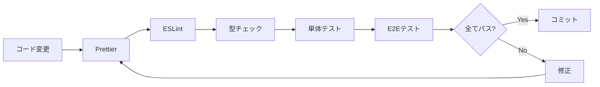

# 06_testing.md - テスト設計

## 概要

**テスト方針**: 個人開発プロジェクトとして、保守コストを抑えつつ品質を担保
**優先順位**: 重要な機能 > UI/UX > エッジケース
**自動化レベル**: CI/CD で自動実行（GitHub Actions）

---

## テスト戦略

### 品質保証の多層防御


### テスト＆静的解析の実行順序



---

## 静的解析ツール

### 1. TypeScript（型チェック）

- **目的**: コンパイル時の型安全性保証、実行前にバグを検出
- **設定**: `tsconfig.json` を参照
- **実行**: `pnpm type-check`

### 2. ESLint（リンター）

- **目的**: コードの問題を自動検出、ベストプラクティスの強制
- **設定**: `eslint.config.js` を参照
- **実行**: `pnpm lint` / `pnpm lint:fix`

### 3. Prettier（フォーマッター）

- **目的**: コードスタイルの統一
- **設定**: `.prettierrc`, `.prettierignore` を参照
- **実行**: `pnpm format:check` / `pnpm format`

> 各ツールのコマンド一覧は `package.json` の `scripts` を参照。

---

## Git Hooks（Husky + lint-staged）

### 目的

- コミット前に自動チェック
- 不正なコードのコミットを防止

### 実行フロー


> 設定は `.husky/pre-commit` および `package.json` の `lint-staged` セクションを参照。

---

## テストピラミッド


---

## テスト技術スタック

| 種類       | ツール                | 用途                     |
| ---------- | --------------------- | ------------------------ |
| 単体テスト | Vitest                | ロジック・ユーティリティ |
| 統合テスト | React Testing Library | コンポーネント統合       |
| E2Eテスト  | Playwright            | ユーザーフロー           |
| モック     | Vitest Mock           | LocalStorage、外部API    |
| カバレッジ | Vitest Coverage (v8)  | コードカバレッジ測定     |

> テストランナー設定は `vitest.config.ts`、E2E設定は `playwright.config.ts` を参照。

---

## 単体テスト（Unit Tests）

### 対象

- ユーティリティ関数
- カスタムフック（ロジックのみ）
- Zodスキーマ
- サービス層（副作用を含む）

### テストファイル配置

テストファイルはソースファイルと同じディレクトリにコロケーション配置する。

```
src/
├── utils/coinFlip.test.ts
├── features/
│   ├── storage/storageOperations.test.ts
│   ├── game/game.schema.test.ts
│   ├── game/useGameLogic.test.ts
│   └── result/result.schema.test.ts
├── services/share.service.test.ts
e2e/
├── home.spec.ts
├── game.spec.ts
└── result.spec.ts
```

### テストパターン

#### ランダム性のテスト

`vi.mock` でモジュール全体をモックするのではなく、`vi.spyOn(Math, "random")` で最小限のモックを使用する。`flipCoin` は内部で `Math.random()` を使うため、乱数を制御すれば結果を制御できる。

#### Zodスキーマのテスト

正常データのパース、不正データ（負数、小数、文字列）の拒否、デフォルト値の適用、配列の最大件数制約をテストする。

#### LocalStorage操作のテスト

`localStorage` をモックし、初回ロード時のデフォルト値、データ保存・読み込み、不正データ時のフォールバック、トップスコアのソート・件数制限をテストする。

#### SNSシェアのテスト

`window.open` をモックし、シェアテキスト生成ロジック（通常プレイ / 新記録 / ランクイン）、各SNSのURL構築をテストする。

> 各テストの実装は対応する `*.test.ts` / `*.test.tsx` ファイルを参照。

---

## 統合テスト（Integration Tests）

### 対象

- コンポーネント + カスタムフック
- ページ全体の動作
- ユーザーインタラクション

### テストパターン

- **ModeCard**: モード情報表示、ベストスコア表示（未プレイ時は「未プレイ」）、クリック時コールバック
- **ResultPage**: スコア表示、新記録アニメーション表示、state なし時のリダイレクト

---

## CI/CD統合

### CI ワークフロー

PR時に以下を自動実行:

1. `pnpm format:check`
2. `pnpm lint`
3. `pnpm type-check`
4. `pnpm test:unit`

> ワークフロー設定は `.github/workflows/ci.yml` を参照。

**ポイント:**

- CIはプルリクエスト時のみ実行（`push` トリガーなし）
- Node.jsバージョンは `.nvmrc` から読み取り
- pnpmバージョンは `package.json` の `packageManager` フィールドから自動取得

---

## VSCode設定

> エディタ設定は `.vscode/settings.json`、推奨拡張機能は `.vscode/extensions.json` を参照。

---

## 品質チェックリスト

### コミット前

- [ ] `pnpm format` でフォーマット
- [ ] `pnpm lint` でエラーなし
- [ ] `pnpm type-check` でエラーなし
- [ ] `pnpm test:unit` で全テストパス

### Pull Request前

- [ ] `pnpm check` で全チェックパス
- [ ] `pnpm test:e2e` で全テストパス
- [ ] カバレッジ 70%以上維持

### デプロイ前

- [ ] CI/CDで全チェックパス
- [ ] Lighthouse スコア 90点以上
- [ ] 本番環境変数設定完了

---

## トラブルシューティング

### Huskyが動作しない

```bash
rm -rf .husky
pnpm exec husky init
```

### ESLintとPrettierが競合

`eslint-config-prettier` を導入して競合ルールを無効化する。

### 型チェックが遅い

`pnpm type-check:watch` で増分ビルドを有効化する。

---

## 関連ファイル

| ファイル                   | 役割                |
| -------------------------- | ------------------- |
| `tsconfig.json`            | TypeScript設定      |
| `eslint.config.js`         | ESLint設定          |
| `.prettierrc`              | Prettier設定        |
| `.husky/pre-commit`        | Git Hookスクリプト  |
| `package.json`             | pnpm スクリプト定義 |
| `vitest.config.ts`         | テストランナー設定  |
| `playwright.config.ts`     | E2Eテスト設定       |
| `.vscode/settings.json`    | VSCode設定          |
| `.github/workflows/ci.yml` | CI/CD設定           |

---

**作成日**: 2025年
**バージョン**: 2.0
